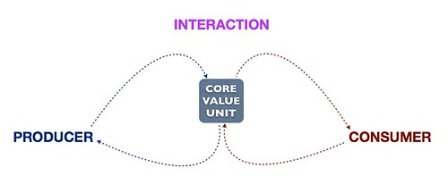
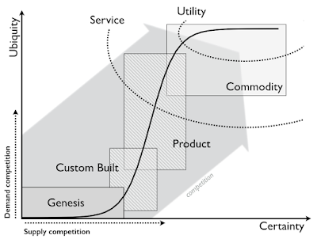
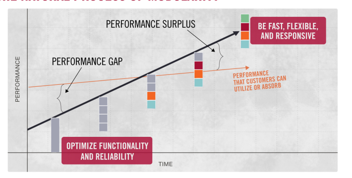
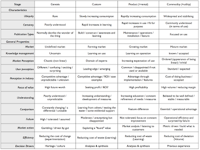
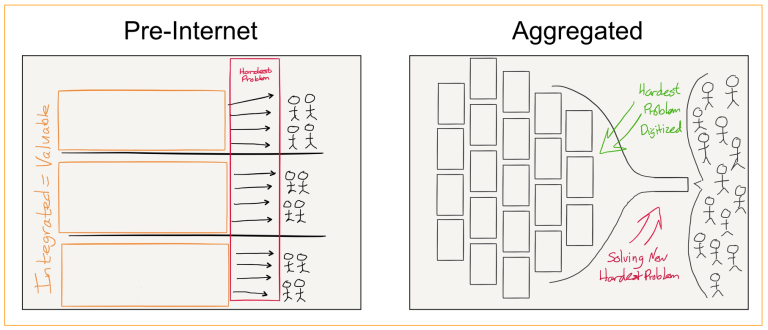
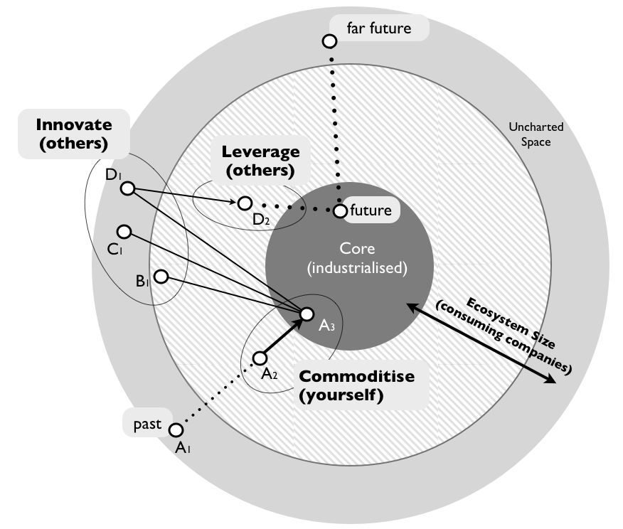
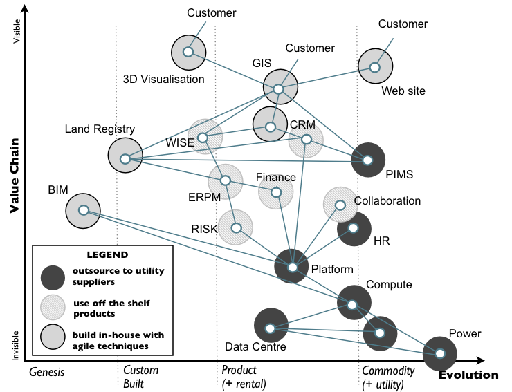

# Why Do We Need a Platform? What Is a Platform?

In the digital age, platforms have emerged as more than just technological infrastructures; they are the cornerstone of contemporary business strategies. This document explores the essence of platforms, delineating their significance and the underlying concepts that drive their creation and success. We'll delve into both the theoretical underpinnings and practical applications of platform economies.

## Introduction

Platforms form the cornerstone of the digital economy, providing a foundation for the exchange of goods, services, and social currency. Unlike traditional business models, which directly manage product or service creation and distribution, platforms foster an ecosystem where independent creators, developers, and consumers interact and transact freely. This approach leverages network effects, enhancing value with each new participant.

## Why Platforms Are Pivotal

Platforms have become ubiquitous in the digital landscape, touching every sector and catering to a myriad of interests. This widespread dominance is primarily fueled by three key factors:

- **Technological Advancements**: The proliferation of the internet and mobile technology has democratized the creation and participation in platform ecosystems, making them accessible to a vastly broader audience.
- **Economic Shifts**: The global economy's pivot towards services and access over ownership highlights the changing consumer preferences and the increased value placed on flexibility and convenience.
- **Social Dynamics**: There's a growing appreciation for community-driven models and collaborative efforts, signaling a shift in how value and success are perceived in the business world.

Following this, the importance of **core interactions** cannot be overstated in the realm of platforms. The concept, which originates from the seminal work *Platform Revolution*, underlines the essential exchanges that occur within a platform's ecosystem—between consumers, producers, or both. These interactions are the very pulse of a platform, propelling engagement, enabling transactions, and amplifying the platform's value and expansion. Crafting and fostering these core interactions are critical; they not only enhance the platform's allure, drawing more participants, but they also set in motion a virtuous cycle of innovation and growth, further cementing the platform's significance in the digital economy.

## Modularity and Commoditization

The evolution of products and services from novel inventions to commodities is a journey that's often complex and multifaceted. Simon Wardley's Map offers a valuable perspective on this process by illustrating how different elements evolve through competition and user demand.

The map showcases the life cycle of an entity, be it a product, practice, or piece of knowledge, as it evolves from being a rare innovation to a common commodity. The evolution is represented as follows:

- **Genesis**: Unique and newly created, requiring significant investment in research and development.
- **Custom Built**: Tailored solutions that are becoming more understood but are still relatively rare.
- **Product**: More mature in the evolution process, with products becoming standardized and widely used.
- **Commodity/Utility**: The final stage where a product or service becomes so common it's treated as a basic utility.

This path not only marks the increase in the ubiquity and certainty of a product or service but also signals a shift in focus from supply competition (creating unique offerings) to user competition (creating value from widespread offerings).

> The reason why you build a platform is to enable an ecosystem. A platform is simply those components (ideally expressed through APIs) that your ecosystem exploits.
> The reason why you build an ecosystem is for componentisation effects and to exploit others through data mining on consumption.
Source: <https://blog.gardeviance.org/2015/08/on-platforms-and-ecosystems.html>

## The Law of Modularity

The Law of Modularity dictates that as technologies and practices evolve and become commoditized, they tend to transform into more modular systems. This principle has significant implications for platform design and strategy.

- **Modularity**: In a modular system, components are designed to be interchangeable and capable of functioning seamlessly within multiple systems. This design principle emphasizes flexibility and adaptability—modular components can be easily connected or replaced according to changing needs or technologies. As products and services evolve, they generally move toward modularity, which allows for broader integration and serves the diverse requirements of various users and industries.

- **Interdependence**: Interdependence stands in contrast to modularity. In an interdependent system, the components are closely linked, with the performance and functionality of one component often depending on the proper operation of another. Such systems are common in the early stages of technological evolution—think custom-built solutions tailored for specific purposes. However, as the market demands more standardization and compatibility, the trend shifts toward modularity. Modular systems enable a scalable and flexible approach that can quickly adapt to market changes and user demands without the need for significant overhauls.

As depicted in the accompanying Wardley Map, each stage of evolution—from Genesis to Commodity—exhibits unique characteristics and requires different management strategies. These stages align with the shift from interdependence to modularity, underscoring how essential it is for organizations to recognize and adapt to these evolutionary patterns. The map highlights not just the technological aspects, but also the changes in knowledge management, user perception, and market efficiency, painting a comprehensive picture of evolution within platform ecosystems.

Understanding this evolutionary path is critical for strategists and architects who are tasked with designing systems that are resilient, adaptable, and able to grow with the demands of the marketplace. By recognizing the signs of maturation and integrating the Law of Modularity into platform development, businesses can position themselves to thrive amidst the constant flux of the digital landscape.

## The Roles of Aggregators in Platform Economies

Aggregators are entities that amass content, services, or products from various sources and make them available to users in a unified manner. They have gained prominence in the digital era by redefining how value is created and distributed in the platform economy. Aggregation Theory elucidates how these players impact markets and transform traditional business dynamics.

Aggregation Theory posits that the Internet has fundamentally shifted the balance of power toward platforms that excel at aggregating consumer demand. This shift arises from:

1. **The Demise of Distribution Costs**: The collapse of distribution costs due to the Internet has nullified the advantage once held by pre-Internet distributors. Traditionally, these distributors could command the market by integrating backwards into the supply chain, but they now contend with platforms that distribute more efficiently at scale.

2. **The Reduction of Transaction Costs**: The Internet has also slashed transaction costs, enabling platforms to scale by directly serving consumers. Success has thus transitioned from controlling supply to mastering consumer relationships.

The transformative role of aggregators in the digital ecosystem complements the fundamental nature of platforms. While aggregators consolidate disparate offerings to simplify user access and improve the overall experience, platforms serve as the foundational infrastructure that underpins these ecosystems. Platforms support the creation and delivery of products and services, providing stable, standardized elements, often accessible via APIs, fostering an environment rich in innovation.

It's the ability of platforms to cultivate a balanced ecosystem that sets them apart—prioritizing user needs, minimizing friction, and ensuring the relevance and accessibility of components. The true differentiation of a platform does not lie in the standalone services it provides but rather in its capacity to facilitate a network of interactions. It is this strategic capability that underscores the role of platforms in propelling innovation, efficiency, and competitive advantage in the digital economy.

> It is no accident that Apple and Microsoft, the two “bicycle of the mind” companies, were founded only a year apart, and for decades had broadly similar business models: sure, Microsoft licensed software, while Apple sold software-differentiated hardware, but both were and are at their core personal computer companies and, by extension, platforms…
> Google and Facebook, on the other hand, are products of the Internet, and the Internet leads not to platforms but to aggregators. While platforms need 3rd parties to make them useful and build their moat through the creation of ecosystems, aggregators attract end users by virtue of their inherent usefulness and, over time, leave suppliers no choice but to follow the aggregators’ dictates if they wish to reach end users.
Source: <https://stratechery.com/2018/techs-two-philosophies/>

## Exploring the Innovate-Leverage-Commoditize (ILC) Model

The Innovate-Leverage-Commoditize (ILC) model is a strategic framework that platforms use to sustain growth and remain competitive. It's a cyclical process:

1. **Innovate**: Platforms innovate by creating or adopting new technologies or services.
2. **Leverage**: They leverage these innovations by enabling external parties to build upon them, often becoming the foundation of a thriving ecosystem.
3. **Commoditize**: Finally, platforms commoditize these innovations, integrating them into their core offerings to enhance their value proposition and open new revenue streams.

The ILC model thrives on rapid access to information and the scale of the ecosystem, allowing platforms to continuously adapt and refine their services in response to user needs and emerging trends.

### Case Study: Amazon and the ILC Model

Amazon exemplifies the Innovate-Leverage-Commoditize (ILC) model, showcasing a method by which platforms can harness innovation for sustained growth and competitive advantage. Initially, Amazon commoditized essential services, like those offered through Amazon Web Services (AWS), providing scalable cloud computing resources. This commoditization laid the foundation for external innovation, allowing companies to build and scale applications affordably. As innovations emerged on AWS, Amazon leveraged these developments by identifying and analyzing usage patterns and customer feedback, determining which services or technologies were gaining popularity.

For example, the adoption of cloud-based storage and computing indicated a demand for specialized cloud solutions, leading to the development of services like Amazon S3 and Amazon EC2. These not only expanded Amazon’s cloud ecosystem but also reinforced its market dominance. Amazon’s capability to rapidly integrate successful external innovations into its ecosystem—such as introducing Amazon SageMaker to democratize machine learning—illustrates a key strength of the ILC model.

Amazon has fostered a virtuous cycle of innovation, continuously feeding new developments into its ecosystem, minimizing R&D risks, and ensuring market adaptability. The vast ecosystem of consumers and businesses that Amazon commands significantly contributes to this model's success, offering a wealth of data and insights for Amazon to draw upon. This strategy has cemented Amazon's market leadership and established a framework for ongoing adaptation and innovation in the digital marketplace.

## The Platform Manifesto

The Platform Manifesto, with its deep strategic insights into the evolution from pipes to platforms and the meticulous crafting of core interactions, lays out a comprehensive roadmap for digital transformation. It underlines the critical importance of ecosystem attentiveness, adaptability, foresight, and a user-centered approach in nurturing platforms capable of thriving amidst digital evolution. The manifesto asserts:

- **The Ecosystem as Warehouse and Supply Chain**: *The ecosystem is the new warehouse; The ecosystem is also the new supply chain*
- **Network Effects and Scale**: *The network effect is the new driver for scale*
- **Data as Currency**: *Data is the new dollar*
- **Redefining Human Resources**: *Community management is the new human resource management*
- **Inventory Control Reimagined**: *Liquidity management is the new inventory control*
- **Quality Assurance Evolution**: *Curation and repetition are the new quality control*
- **The New Sales Funnel**: *User journeys are the new sales funnels*
- **Rethinking Distribution**: *Distribution is the new destination*
- **Innovating Loyalty**: *Behavior design is the new loyalty program*
- **Business Process Optimization Through Data**: *Data science is the new business process optimization*
- **The Role of Social Feedback**: *Social feedback is the new sales commission*
- **The Rise of Algorithmic Decision-Making**: *Algorithms are the new decision makers*
- **Market Research Transformed**: *Real-time customization is the new market research*
- **A New Approach to Business Development**: *Plug-and-play is the new business development*
- **Digital Market Regulation**: *The invisible hand is the new iron fist*

[Explore the Platform Manifesto in full](https://www.slideshare.net/sanguit/the-platform-manifesto-16-principles-for-digital-transformation)

## Summary

Through this document, we've unpacked the complexities and nuances of platform economies. Let's encapsulate our key takeaways:

- **Platforms as Foundations**: Platforms transcend mere digital infrastructure to become robust ecosystems that enable the free exchange of goods, services, and social currency. Their ability to facilitate previously infeasible interactions and leverage network effects differentiates them from traditional business models.

- **Ecosystem Synergy**: The vitality of platforms is amplified by their interplay with aggregators, which augment the ecosystem by improving access to services and content. This symbiosis is crucial for fostering innovation and developing new market opportunities.

- **Innovate-Leverage-Commoditize**: Amazon's strategic application of the ILC model demonstrates how platforms can drive continuous innovation. By integrating this model into their operations, platforms can adapt, grow, and stay competitive.

- **A Blueprint for the Future**: The Platform Manifesto’s principles serve as a guide for digital transformation, advocating for business models that prioritize ecosystem engagement and shared value creation. These principles are foundational to understanding and leveraging the transformative power of platforms.

In closing, platforms are more than technological constructs; they are the bedrock of innovation and transformation in our interconnected world. As exemplified by Amazon and illuminated by the Platform Manifesto, platforms are instrumental in crafting the future of the digital economy, offering a framework for sustained growth and competitiveness.
