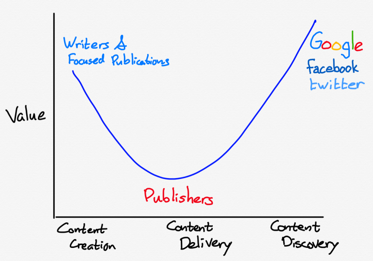

# Platform Landscape & Opportunities

As we stand amidst the burgeoning platform economy, the quest to identify and exploit platform opportunities becomes a pivotal mission for innovators and business leaders. This document is tailored to guide you through the intricacies of the platform landscape, illuminating paths to uncover potential ventures and capitalize on the platform revolution.

## Introduction

The emergence of digital platforms has mirrored the smiling curve phenomenon in the IT manufacturing industry. Just as the smiling curve illustrates that the conception and marketing stages hold the most value, platforms thrive on these high-value activities by facilitating innovative services and connecting users and producers in a marketplace model.

Platforms operate at the value-adding poles of the curve: ideation, where innovative solutions and user experiences are conceived, and user interaction, where robust communities and market presence are built. By focusing on these high-value aspects, platforms create and capture immense worth, bypassing the capital and labor-intensive aspects traditionally associated with lower value.

By understanding the strategic positioning of platforms along the smiling curve, businesses and entrepreneurs can navigate the platform landscape with a clear focus on where to invest their energies to extract maximum value. This document serves as a blueprint for identifying and harnessing platform opportunities that promise not just profitability but also longevity and market influence.

## Core Framework for Platform Growth: Pull, Facilitate, Match

The essence of a thriving platform lies in its ability to Pull participants, Facilitate their interactions, and Match them effectively:

- **Pull**: Platforms must draw in participants by offering compelling reasons to engage. This involves leveraging network effects and creating positive feedback loops to sustain engagement.
- **Facilitate**: The platform should streamline interactions, ensuring a seamless and safe experience. It involves removing barriers and fostering an environment of trust.
- **Match**: A sophisticated understanding of user preferences is used to connect the right participants, heightening the relevance and value of interactions on the platform.

## Structural Transformations Due to Platforms

Platforms disrupt established industry structures in three key ways:

- **Decoupling Assets from Value**: They demonstrate that value creation can be separated from asset ownership.
- **Introducing New Intermediaries**: Platforms act as new intermediaries, better connecting supply and demand using data and algorithms.
- **Consolidating Fragmented Markets**: They aggregate supply, simplifying consumer choice and improving market efficiency.

## From Pipelines to Platforms: A Paradigm Shift

The shift from pipeline to platform models represents a paradigm shift from controlling resources to orchestrating ecosystems:

- **Efficiency and Scale**: Platforms scale by leveraging external contributions, diminishing the need for asset ownership.
- **Innovation and Agility**: They thrive on user contributions, adapting swiftly to market changes and opportunities.
- **Value Creation**: The value to participants grows with the network, powered by their collective interactions.

## Spotting Industry Readiness for Platform Revolution

Industries primed for platform disruption share common traits:

- **Information Intensity**: Sectors where information is a key value driver, such as media and telecom, are ripe for platform transformation.
- **Non-scalable Gatekeepers**: Industries reliant on inefficient intermediaries, like retail and publishing, offer significant opportunities for platforms.
- **Fragmentation and Information Asymmetries**: Markets characterized by fragmentation or information imbalances are vulnerable to platform disruption, which can introduce transparency and efficiency.

However, not all industries are equally susceptible to platform disruption. High regulatory barriers, the perceived high costs of failure, and resource-intensive nature can impede platform adoption in sectors like healthcare, education, and banking.

## Summary

In our exploration of the platform landscape, we've highlighted the transformative role digital platforms play in today's market dynamics. We've broken down the core mechanisms of platforms and how they open up new possibilities for value creation and business innovation.

- **Core Mechanisms of Platforms**: Platforms succeed by attracting users (Pull), enabling interactions (Facilitate), and connecting the right participants (Match). These actions are the engines of vibrant platform ecosystems, propelling community growth and continuous engagement.

- **Shift from Linear to Networked Models**: The evolution from traditional pipeline businesses to platform models underscores the digital age's influence on economic engagement. This shift has ushered in a new era of scalability, innovation, and value creation that leverages network effects and external collaborations.

- **Navigating Platform Disruption**: We've observed how platforms can disrupt industries by delinking asset ownership from service delivery, introducing new intermediation forms, and consolidating fragmented markets. These disruptions are key to understanding how platforms can reshape industries.

- **Identifying Opportunities for Disruption**: Certain industry traits—like high information intensity, reliance on inefficient gatekeepers, and market fragmentation—signal readiness for platform revolution. Conversely, challenges such as regulation and resource intensity may slow platform adoption in some sectors.

