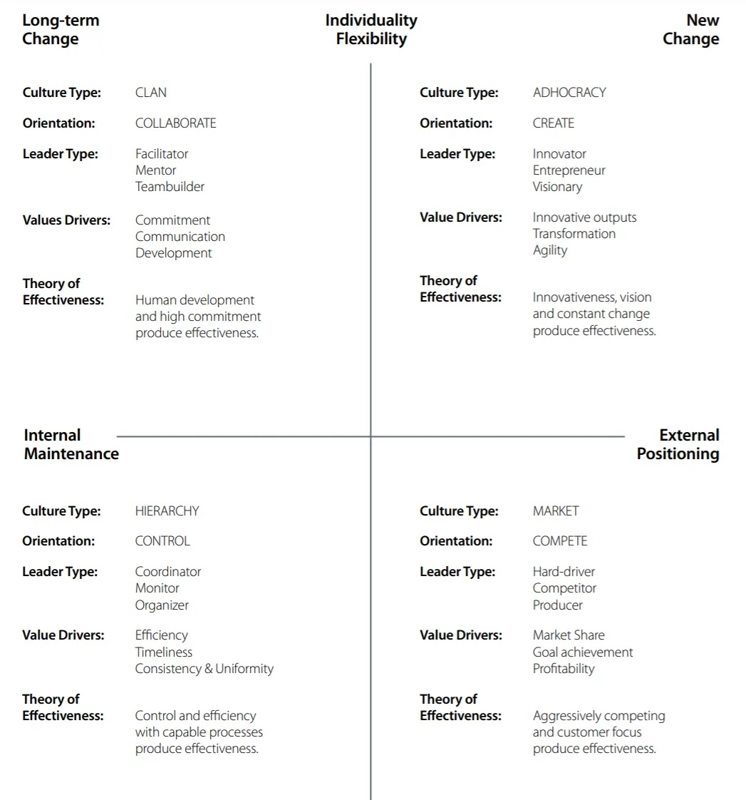

# Competing Values Framework & Bj Fogg Behavior Model

# Competing Values Framework

O Competing Values Framework (CVF), desenvolvido por Robert Quinn e John Rohrbaugh, surgiu como uma ferramenta inovadora para entender a eficácia organizacional e a cultura organizacional. Ao longo de mais de vinte e cinco anos, este modelo tem sido validado por inúmeros estudos, tornando-se fundamental para líderes e organizações que buscam compreender e aprimorar suas operações e estratégias.

O CVF evoluiu de pesquisas destinadas a determinar os principais fatores de eficácia organizacional. Essas pesquisas inicialmente geraram uma lista abrangente de 39 possíveis indicadores de eficácia, que foram posteriormente condensados por Quinn e Rohrbaugh (1983) em duas dimensões principais, definindo quatro quadrantes que representam suposições opostas e concorrentes. Estas dimensões são: flexibilidade versus estabilidade e foco interno versus foco externo.

## Eixos do CVF
O CVF se baseia em duas dimensões principais: flexibilidade versus estabilidade e foco interno versus externo, criando quatro quadrantes distintos.

### Eixo Vertical: Flexibilidade vs. Estabilidade
O eixo vertical do CVF representa uma dinâmica fundamental dentro das organizações, equilibrando a necessidade de flexibilidade e mudança com a de estabilidade e controle. Este eixo reflete como uma organização se adapta às mudanças e inovações, mantendo ao mesmo tempo suas estruturas e processos fundamentais.
- **Flexibilidade e Mudança**: Cultura de inovação, estrutura horizontal, e tomada de decisão descentralizada.
- **Estabilidade e Controle**: Cultura de consistência, estrutura verticalizada, e processos definidos.

### Eixo Horizontal: Foco Interno vs. Externo
O eixo horizontal do CVF ilustra a orientação organizacional entre um foco interno, voltado para a integração e colaboração interna, e um foco externo, direcionado para o mercado e a competição.
- **Foco Interno e Orientado à Pessoa**: Cultura de colaboração, coesão interna, e desenvolvimento do capital humano.
- **Foco Externo e Orientado à Organização**: Cultura de competitividade, orientação para resultados e inovação de mercado.

*(Fonte: [The competing values framework & Culture Contract [Quinn & NOBL]](https://orghacking.com/the-competing-values-framework-culture-contract-quinn-nobl-7d1471c2cbe9))*

## Quadrantes do CVF

### 1. Quadrante da Colaboração (Clã)
Organizações neste quadrante priorizam relações pessoais e um ambiente de trabalho harmonioso.

- **Propósito**: Construir um ambiente colaborativo e comunitário.
- **Pessoas**: Desenvolvimento individual e coletivo com foco no bem-estar.
- **Valores**: Cooperação, comprometimento e comunicação.
- **Liderança**: Mentores que nutrem e desenvolvem a equipe.
- **Práticas**: Inclusão, comunicação aberta e trabalho em equipe.
- **Como somos efetivos?**: Desenvolvimento de pessoas e coesão interna.

### 2. Quadrante da Criação (Adhocracia)
Este quadrante abrange organizações inovadoras com foco em flexibilidade e adaptação ao mercado.

- **Propósito**: Inovação contínua e resposta às mudanças do mercado.
- **Pessoas**: Autonomia e criatividade.
- **Valores**: Criatividade e inovação.
- **Liderança**: Visionários que incentivam a experimentação.
- **Práticas**: Inovação e adaptação rápida.
- **Como somos efetivos?**: Inovação e adaptação às tendências do mercado.

### 3. Quadrante do Controle (Hierarquia)
Caracteriza organizações com alta estabilidade e um foco interno em eficiência e processos.

- **Propósito**: Eficiência e estabilidade organizacional.
- **Pessoas**: Conformidade e adesão a regras.
- **Valores**: Ordem e consistência.
- **Liderança**: Administradores focados em ordem.
- **Práticas**: Processos definidos e controle.
- **Como somos efetivos?**: Estrutura organizada e conformidade.

### 4. Quadrante da Competição (Mercado)
Este quadrante descreve organizações orientadas para resultados, competitividade e sucesso no mercado.

- **Propósito**: Superar metas de mercado e eficiência.
- **Pessoas**: Foco em performance e produtividade.
- **Valores**: Eficiência e conquista de objetivos.
- **Liderança**: Decisores focados em metas de mercado.
- **Práticas**: Orientação para resultados e competitividade.
- **Como somos efetivos?**: Abordagem pragmática e foco em resultados.

# BJ Fogg Behavior Model

O BJ Fogg Behavior Model é um modelo conceitual desenvolvido por BJ Fogg, que explica como os comportamentos humanos são influenciados por três elementos principais: motivação, capacidade e gatilhos. Este modelo é fundamental para compreender e desenvolver estratégias eficazes para mudanças de comportamento em diversos contextos. O modelo é amplamente aplicado em diversas áreas, incluindo design de produtos, marketing, saúde e desenvolvimento pessoal.

*(Fonte: [Fogg Behavior Model](https://behaviormodel.org/))*

## Elementos do Modelo

### Motivação
A motivação refere-se ao desejo de realizar um comportamento. Ela pode variar desde a busca por prazer até a necessidade de evitar dor ou desconforto. No entanto, a motivação por si só pode não ser suficiente para levar à ação se a capacidade de realizar o comportamento estiver ausente. Por exemplo, um usuário pode ter pouca motivação para fornecer seu endereço de e-mail em um site, a menos que haja um incentivo significativo, como receber uma newsletter gratuita.

#### Fatores que Influenciam a Motivação:
- **Prazer vs. Dor**: As pessoas são motivadas tanto pelo desejo de buscar experiências prazerosas quanto pela necessidade de evitar dor ou desconforto.
- **Esperança vs. Medo**: A motivação pode ser impulsionada pela esperança de alcançar algo positivo ou pelo medo de algo negativo.
- **Aceitação Social vs. Rejeição**: A busca por aceitação social ou o medo da rejeição também são fortes motivadores.

#### Exemplo Prático:
- **Incentivo para Ação**: Um usuário pode ter pouca motivação para fornecer seu endereço de e-mail em um site. No entanto, a motivação pode aumentar significativamente se houver um incentivo, como o acesso a uma newsletter gratuita ou a um conteúdo exclusivo.

### Capacidade (Simplicidade)
Capacidade diz respeito à habilidade de uma pessoa de realizar um comportamento. Inclui fatores como tempo, recursos, habilidades físicas e mentais. Em situações onde a capacidade é baixa, mesmo um alto nível de motivação pode não ser suficiente para realizar o comportamento. Por exemplo, adicionar um desafio matemático em um formulário pode diminuir a capacidade do usuário de completá-lo, mesmo que ele esteja motivado para se inscrever.

#### Elementos da Simplicidade:
A simplicidade, conforme definida por BJ Fogg, tem seis partes essenciais que funcionam como elos de uma corrente: se qualquer elo falhar, a simplicidade é perdida.

1. **Tempo**: Se um comportamento requer muito tempo e a pessoa não dispõe desse tempo, então o comportamento não é simples.
2. **Dinheiro**: Para pessoas com recursos financeiros limitados, comportamentos que custam dinheiro não são simples.
3. **Esforço Físico**: Comportamentos que exigem esforço físico significativo podem não ser simples.
4. **Ciclos Cerebrais**: Comportamentos que requerem muito esforço mental ou concentração podem não ser simples, especialmente se a mente da pessoa já estiver ocupada com outras questões.
5. **Desvio Social**: Comportamentos que exigem que a pessoa aja de maneira socialmente desviante não são simples.
6. **Rotina**: Pessoas tendem a achar comportamentos simples se eles são rotineiros, enquanto comportamentos não rotineiros podem ser vistos como mais complexos.

#### Simplicidade Como Recurso Escasso:
Simplicidade é uma função do recurso mais escasso de uma pessoa no momento em que um comportamento é desencadeado. O design persuasivo deve focar em identificar e reduzir essas barreiras, tornando o comportamento mais simples ao invés de apenas tentar aumentar a motivação.

#### Exemplo Prático:
A funcionalidade de "compra com 1 clique" da Amazon é um exemplo clássico de simplicidade em ação. Ao reduzir o esforço necessário para realizar uma compra, a Amazon aumentou significativamente a capacidade dos usuários de realizar o comportamento de compra.

### Gatilhos
Sem um gatilho apropriado, o comportamento não ocorrerá, mesmo que haja motivação e capacidade. Um gatilho pode ser qualquer coisa que indique à pessoa que agora é o momento de realizar o comportamento. O sucesso dos gatilhos depende do seu momento: eles devem ocorrer quando a pessoa está tanto motivada quanto capaz de realizar o comportamento. Por exemplo, um lembrete para praticar um instrumento musical é eficaz apenas se ocorrer quando a pessoa está disposta e apta a praticar.

Com o advento da tecnologia persuasiva, a importância dos gatilhos cresceu significativamente. Muitos comportamentos desejáveis são realizados usando computadores ou dispositivos móveis, onde gatilhos podem levar a uma resposta imediata. Isso cria uma forte ligação entre o gatilho e o comportamento, que não era possível com mídias tradicionais como TV ou jornais.

#### Tipos de Gatilhos
- **Faísca como Gatilho**: Uma "faísca" é um gatilho que motiva o comportamento. É adequada quando uma pessoa carece de motivação para realizar um comportamento-alvo. Exemplos de faíscas podem variar de textos que destacam medos até vídeos que inspiram esperança, aproveitando os elementos motivacionais.
- **Facilitador como Gatilho**: O "facilitador" é um tipo de gatilho adequado para usuários com alta motivação, mas que carecem de capacidade. O objetivo de um facilitador é acionar o comportamento enquanto torna mais fácil realizá-lo. Exemplos incluem atualizações de software que sugerem simplicidade, como "um clique para atualizar", ou ferramentas que facilitam a conexão com amigos com apenas alguns cliques.
- **Sinal como Gatilho**: O "sinal" é o terceiro tipo de gatilho e é mais eficaz quando as pessoas já possuem tanto a capacidade quanto a motivação para realizar o comportamento. O sinal serve apenas como um lembrete. Não procura motivar ou simplificar a tarefa, apenas indica o momento apropriado para o comportamento. Um exemplo comum de sinal é um semáforo que muda de cor.

## Comportamento = Motivação x Capacidade x Gatilho

A fórmula central do BJ Fogg Behavior Model pode ser resumida como "Comportamento = Motivação x Capacidade x Gatilho". Esta equação representa a ideia de que um comportamento desejado ocorrerá quando uma pessoa estiver motivada, capaz e receber um gatilho apropriado no momento certo.

### Inter-relação dos Elementos

- **Motivação e Capacidade**: Estes dois elementos podem compensar um ao outro até certo ponto. Uma pessoa com alta motivação pode superar uma baixa capacidade para realizar um comportamento, e vice-versa. Por exemplo, se alguém está extremamente motivado para se inscrever em uma newsletter (alta motivação), pode tolerar um processo de inscrição mais complicado (baixa capacidade).
  
- **Capacidade e Gatilhos**: Mesmo que a capacidade seja alta e os gatilhos estejam presentes, sem a motivação necessária, o comportamento pode não acontecer. Da mesma forma, gatilhos eficazes são inúteis se a pessoa não tem a capacidade de realizar o comportamento.

- **Motivação e Gatilhos**: Gatilhos são mais eficazes quando a pessoa já está motivada. Por exemplo, uma promoção de venda pode ser um gatilho eficaz para alguém que já está interessado em comprar um produto.

## Resumo

O Competing Values Framework (CVF) e o BJ Fogg Behavior Model são ferramentas poderosas que oferecem insights valiosos sobre liderança, cultura organizacional e mudança de comportamento.

> **CVF - Flexibilidade vs. Estabilidade e Foco Interno vs. Externo**: O CVF revela como diferentes combinações de flexibilidade, estabilidade, foco interno e externo caracterizam a cultura e a eficácia organizacional. Este modelo ajuda as organizações a identificar sua cultura atual e a direcionar suas estratégias para atingir os objetivos desejados.
> 
> **Quadrante da Colaboração (Clã)**: Enfatiza a colaboração, o bem-estar dos colaboradores e a comunicação aberta.
> 
> **Quadrante da Criação (Adhocracia)**: Foca na inovação, adaptabilidade e criatividade.
> 
> **Quadrante do Controle (Hierarquia)**: Prioriza eficiência, ordem e processos bem definidos.
> 
> **Quadrante da Competição (Mercado)**: Orienta-se para metas de mercado, eficiência e competitividade.
> 
> **BJ Fogg Behavior Model - Motivação, Capacidade e Gatilhos**: Este modelo explica como o comportamento é influenciado pela interação entre motivação, capacidade e gatilhos apropriados. É uma ferramenta crucial para criar estratégias que promovam mudanças de comportamento desejadas.
> 
> **Motivação**: Inclui fatores como prazer, dor, esperança e medo.
> 
> **Capacidade (Simplicidade)**: Envolve tornar o comportamento mais fácil de realizar, considerando fatores como tempo, dinheiro, esforço físico, ciclos cerebrais, desvio social e rotina.
> 
> **Gatilhos**: Incluem faíscas (que motivam), facilitadores (que tornam o comportamento mais fácil) e sinais (que lembram ou indicam o momento apropriado para o comportamento).

Cada ferramenta oferece uma perspectiva única e complementar, ajudando as organizações e indivíduos a entenderem melhor os fatores que influenciam a cultura organizacional e o comportamento humano. Ambos são essenciais para lideranças e organizações que buscam eficácia, alinhamento e sucesso contínuo.

## Links Úteis

- [Diagnosing and Changing Organizational Culture: Based on the Competing Values Framework / Kim S. Cameron, Robert E. Quinn]()
- [Competing Values Framework - ToolsHero](https://www.toolshero.com/leadership/competing-values-framework/)
- [O Modelo de Cultura Compete Values Framework - Persora](https://persora.com.br/2021/02/o-modelo-de-cultura-compete-values-framework/)
- [The Competing Values Framework: Culture Contract - OrgHacking](https://orghacking.com/the-competing-values-framework-culture-contract-quinn-nobl-7d1471c2cbe9)
- [Organizational Models Beyond Fixed Hierarchy - Corporate Rebels - OrgHacking](https://orghacking.com/organizational-models-beyond-fixed-hierarchy-corporate-rebels-1f06cc06521a)
- [Competing Values Framework - Denver Leadership](https://denverleadership.org/wp-content/uploads/2016/01/Competing-Values-Framework.pdf)
- [An Introduction to the Competing Values Framework - RCF Group](https://www.thercfgroup.com/files/resources/an_introduction_to_the_competing_values_framework_white_paper-pdf-28512.pdf)
- [Competing Values Framework Can Help Organizations Improve Global Strategic Performance - Regent University](https://www.regent.edu/journal/emerging-leadership-journeys/competing-values-framework-can-help-organizations-improve-global-strategic-performance/)
- [Competing Values Framework - Want to Work There](https://www.wanttoworkthere.com/competing-values-framework)
- [Culture Assessment Workbook - Boom Hoger Onderwijs](https://www.boomhogeronderwijs.nl/media/8/download_pdf_culture_assessment_workbook.pdf)
- [Behavior Model Paper: A Behavior Model for Persuasive Design (2009) por BJ Fogg](https://drive.google.com/file/d/19LYba4fuceGM3KhqxTXByV4msmb33t1o/view)