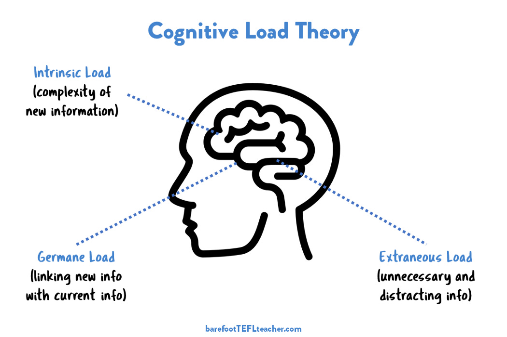
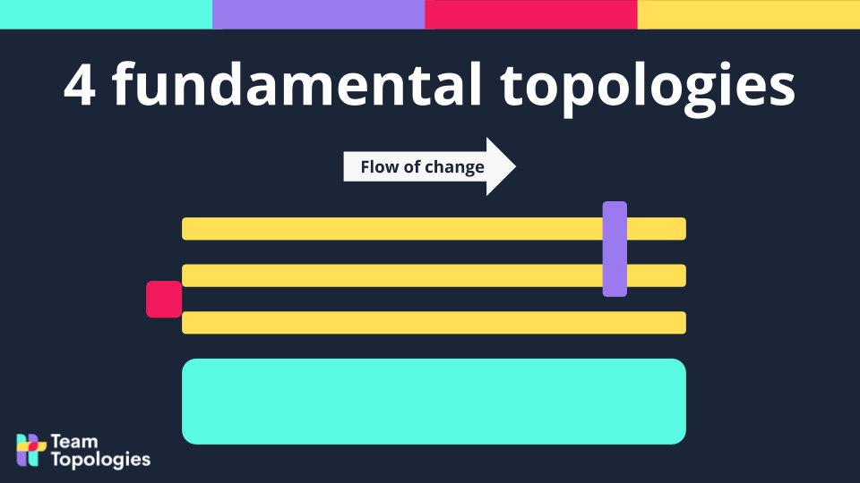
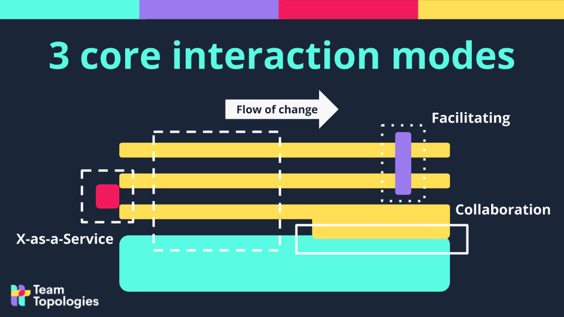
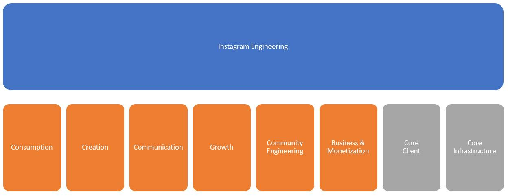
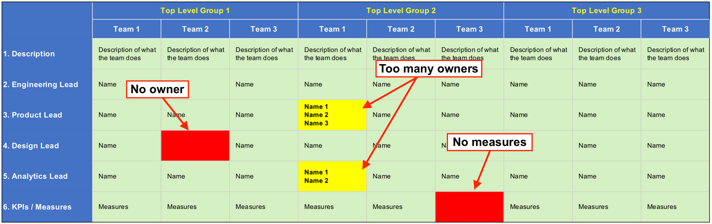

# Streamlining Organizational Complexity: A Strategic Blueprint

In today’s fast-paced business environment, complexity is a given—yet managing it effectively is anything but. This article offers a strategic blueprint for navigating and streamlining organizational complexity, enhancing team productivity, and optimizing operational flow.

## Introduction

In today's fast-paced business environment, grappling with organizational complexity has become a central challenge for companies striving to maintain productivity and agility. This complexity arises from various factors, including technological advancements, global market dynamics, and internal organizational structures. Understanding and effectively managing this complexity is paramount for businesses aiming to make informed decisions and sustain their competitive edge. This article unfolds a strategic blueprint for navigating organizational complexity, emphasizing cognitive load management, team structuring, and process optimization to enhance team productivity and operational efficiency

## Understanding Organizational Complexity and Cognitive Load

Organizational complexity arises from the need to adapt to technological innovations, evolving consumer demands, and the management of diverse team structures. This multifaceted complexity can significantly impede decision-making processes and strategic focus, necessitating a robust strategy for simplification and management.

Cognitive Load Theory highlights how excessive information and decision-making demands can overwhelm individuals' cognitive capacities, affecting team performance (Sweller, 1988). As Sweller et al. put it, "Cognitive load is generated by the instructional design itself, thus it can be controlled by instructional designers." In the context of organizational complexity, reducing cognitive load involves streamlining processes, prioritizing tasks, and leveraging technology to automate routine decisions. These steps are crucial for freeing up cognitive resources, thereby enhancing focus, efficiency, and overall team well-being.

By addressing the root causes of complexity and employing targeted strategies to alleviate cognitive burdens, organizations can foster an environment where innovation and strategic clarity thrive.

## Unpacking Organizational Complexity

Organizational complexity, characterized by intricate processes, diverse product lines, and expansive team structures, often leads to operational inefficiencies and decision-making paralysis. It emerges from multiple sources, including:

- **Rapid Technological Changes**: Constant technological innovations introduce new tools and processes, complicating the operational landscape.
- **Market Dynamics**: Evolving consumer demands and competitive pressures add layers of complexity to business strategies.
- **Internal Structures**: Diverse teams and cross-functional projects, while beneficial, can create challenges in communication and alignment.

This complexity impacts productivity by overwhelming decision-making capabilities and obscuring strategic focus. To counteract these effects, businesses must identify the root causes of complexity within their operations and strategize accordingly.

## Cognitive Load and Its Effects on Teams

Cognitive Load Theory sheds light on how the human brain processes and retains information, highlighting the negative impact of excessive complexity on individual and team performance. When team members are bombarded with too much information or too many decisions, it can lead to:

- **Reduced Efficiency**: Overload impairs individuals' ability to process information effectively, slowing down task completion.
- **Decreased Quality of Work**: The focus on managing multiple streams of information can detract from the quality of outputs.
- **Burnout**: Sustained cognitive overload can result in increased stress levels, leading to burnout and reduced overall well-being.

To mitigate these effects, strategies such as simplifying information presentation, prioritizing tasks, and employing tools that automate routine decisions can be instrumental. Reducing cognitive load frees up mental resources for creativity and problem-solving, thereby enhancing team focus and efficiency.

Incorporating Team Topologies, platform design principles, and Value Stream Mapping into an organizational strategy necessitates a comprehensive understanding of team interactions, processes, and technology. Moreover, Conway's Law provides essential insight into the symbiosis between organizational structures and software design, positing that "organizations which design systems ... are constrained to produce designs which are copies of the communication structures of these organizations" (Conway, 1967). This highlights the critical need for aligning team structures with the architectural goals of the systems they develop.

## Streamlining Operations with Strategic Team Structures and Design Principles

Understanding the management of cognitive load within teams is crucial for enhancing productivity and decision-making. This understanding segues into another foundational concept critical for organizing and designing effective teams: **Conway's Law**. This law highlights the intrinsic link between an organization's structure and its system designs:

> "Organizations which design systems ... are constrained to produce designs which are copies of the communication structures of these organizations."

This insight into system design and organizational structure introduces the necessity for a methodically structured approach to team organization. The framework of **Team Topologies** by Matthew Skelton and Manuel Pais responds to this need, aiming to align team structures with software architecture, mitigate cognitive loads, and streamline workflows.

To further contextualize the challenge of optimizing team structures, we turn to two additional pivotal theories:

- **Dunbar's Number**: Suggests a limit to the number of stable relationships individuals can maintain—typically capped at around 150. This concept underscores the importance of small, manageable team sizes that foster close-knit communication and collaboration, pivotal for reducing cognitive load and enhancing team cohesion.

- **Brooks' Law**: Articulated in Fred Brooks' seminal work "The Mythical Man-Month," this law posits that "adding manpower to a late software project makes it later." It highlights the complexities and inefficiencies that can arise from too large or rapidly expanding teams, especially in contexts requiring high levels of coordination and communication.

Both Dunbar's Number and Brooks' Law emphasize the critical balance teams must strike between size, communication, and effective collaboration. They serve as vital considerations within the **Team Topologies** framework, guiding how teams are structured and interact to minimize cognitive load and maximize productivity. Together, these concepts—Conway's Law, Dunbar's Number, and Brooks' Law—form a comprehensive understanding of the principles underlying successful team organization and system design in the digital age.

### The Genesis of Team Topologies

The emergence of **Team Topologies** was motivated by several key organizational needs:

1. **Alignment with System Architecture**: Adhering to Conway's Law, it became apparent that organizations required a systematic way to design teams that mirrored the desired software architecture, moving beyond traditional hierarchies that create silos.

2. **Cognitive Load Optimization**: As organizations expand, so does the complexity of their systems, placing a heavier cognitive load on teams. There was a clear demand for a framework to effectively manage this load.

3. **Seamless Workflow**: The agility demanded by today's business environment necessitates a model for streamlining team collaboration, eliminating bottlenecks, and ensuring a fluid flow of work.

**Team Topologies** proposes four fundamental team types designed to tackle these challenges:

- **Stream-Aligned Teams**: Focused directly on delivering features or services to users or customers.
- **Enabling Teams**: Provide expertise and support to Stream-Aligned Teams, helping them overcome obstacles.
- **Complicated Subsystem Teams**: Specialize in dealing with technically complex components where a high degree of specialization is required.
- **Platform Teams**: Develop and maintain the platforms that enable Stream-Aligned Teams to deliver their work more efficiently.

### Interactions Among Teams

To maximize the effectiveness of these team types, **Team Topologies** also identifies three types of interactions:

1. **Collaboration**: Working closely together on a problem, often seen between Stream-Aligned and Enabling Teams.
2. **X-as-a-Service**: One team provides a service used by another team, typical of the relationship between Platform Teams and Stream-Aligned Teams.
3. **Facilitating**: Helping (usually by an Enabling Team) another team to overcome obstacles, build capabilities, or improve processes without direct involvement.

These team types and interactions form a strategic approach to managing organizational complexity, aligning closely with Conway's Law. They ensure that teams are not just structured for efficiency but are also positioned to reflect the architectural patterns of the systems they build, thereby enhancing productivity, fostering innovation, and smoothing the flow of work across the organization.

### Distinguishing Value Streams from Platforms

In navigating the intricacies of product development, understanding the distinct contributions of platforms and value streams is pivotal. Here's how they uniquely impact the creation of products that are not just **useful**, but also **usable**, and extend that to ensure those products are ultimately **used**—addressing the importance of their collaboration to mitigate cognitive load and ensure product success:

- **Platforms Provide the Foundation for Useful Products**:
  - Platforms offer essential tools, services, and technologies that enable the initial development phase, focusing on creating products that fulfill a specific need or solve a particular problem—making them inherently **useful**.
  - The responsibility of platforms is to ensure that products have a solid base of functionality and potential for integration, laying the groundwork for further refinement.

- **Value Streams Ensure Products are Usable and Used**:
  - Value Streams take the initial output from platforms and through a series of steps—design, development, and deployment—refine the product to be **usable**. This involves enhancing the user interface, improving user experience, and ensuring the product meets the end users' needs in a practical and enjoyable manner.
  - Beyond usability, the value stream's role is pivotal in ensuring that the product is **used**. This final step transcends the product's features and design, focusing on achieving widespread user adoption and integration into users' lives. It involves understanding market readiness, aligning with user expectations, and implementing strategies for engagement and retention.
  - The transition from usable to used is critical and requires continuous feedback from users, market analysis, and often, iterative design and development to respond to evolving user needs and preferences. Without this focus, even the most innovative and user-friendly products risk falling short of achieving their intended impact.

The disconnection between platform capabilities and value stream execution introduces significant challenges, notably increasing cognitive load across teams. This dissonance arises when platforms lay the groundwork for **useful** products, yet the subsequent evolution within value streams to make these products **usable**—and critically, **used**—stumbles.

Such a disconnect places teams in a difficult position, caught between the potential offered by the platform and the practical demands of user-centric design. This complexity, marked by blurred roles and disjointed processes, not only burdens teams but also hampers productivity and stifles innovation. Clear alignment and coherent collaboration between platform development and value stream processes are essential to mitigate these issues, ensuring that teams can focus on delivering products that meet user needs and achieve widespread adoption.

## Case Study: Instagram's Engineering Team Reorganization

Instagram's engineering team faced the challenge of scaling effectively while improving transparency and functionality. They established organizational principles, creating a framework for decision-making and accountability as they grew.

### Instagram's Organizational Principles

Key organizational principles were established to guide every decision at Instagram, focusing on autonomy and clear objectives:

- Move as Fast as Possible
- Clear Accountability with Fewest Decision Makers
- Clear KPIs for All Groups
- Scalability with Detailed Roadmaps
- High-Quality Standards with Assigned Ownership

These principles informed the reorganization efforts, ensuring consistency and transparency throughout the team's rapid growth.

### Decision-Making Framework for Transparency

Instagram developed a transparent decision-making process incorporating the RACI model:

1. **Diagnose**: Clearly understand the issue at hand.
2. **Organizational Change Proposal**: Suggest changes based on identified issues.
3. **RACI Model Implementation**: Define the roles of decision-makers.
4. **Audit Against Principles**: Ensure proposals align with organizational principles.
5. **Decide and Act**: Finalize decisions and update the Responsibility Matrix.

This process helped demystify decision-making within the organization, promoting clarity and trust.

### The Impact of Reorganization on Team Efficiency and Innovation

Instagram's reorganization efforts emphasize the importance of clear roles and decision-making in fostering an accountable and transparent environment. The transition from basic communication to a model of transparent evaluation and debate of decisions catalyzed a culture of continuous innovation and improvement.

#### Embodying Team Topologies

Instagram's new organizational structure showcases:

- **Foundational Teams**: Core infrastructure and client support for basic functionality.
- **Vertical Teams**: Focused teams on key priorities such as engagement, business platform, growth, protect and care, creation, and communication.

This approach is in line with Team Topologies, promoting autonomous, full-stack teams capable of rapid iteration and aligning with Conway's Law by reflecting desired system architectures in the team structures.

By embracing these principles and reorganizing, Instagram's engineering team was not only able to scale efficiently but also advanced their capacity for innovation, setting a benchmark for other teams facing similar scaling challenges.

### Streamlining Decision-Making with RACI

The RACI model clarified roles, making decision-making efficient and transparent:

- **Responsible**: Task executors.
- **Accountable**: Final decision-makers.
- **Consulted**: Advisors.
- **Informed**: Stakeholders kept up-to-date.

### Responsibility Assignment Matrix (RAM)

A RAM was created to visually represent and operationalize the decision-making framework, highlighting individual roles and addressing misalignments.

### Impact of Reorganization

The redefined roles and clear decision-making processes led to rapid feature launches, such as Instagram Stories, underscoring the power of strategic organization and transparency in a scaling team.

This case study showcases how principles, structured frameworks, and clear accountability can transform a growing team's ability to innovate and make effective decisions.

## Summary: Streamlining Organizational Complexity Through Strategic Innovation

Our comprehensive journey through managing organizational complexity has underscored the critical need for streamlined operations, cognitive load management, and strategic team structuring. Drawing from foundational theories like Conway's Law and incorporating practical frameworks such as Team Topologies and the RACI model, we've outlined a blueprint for enhancing productivity and fostering innovation within complex organizational structures.

- **Addressing Organizational Complexity**: We started by identifying the sources of complexity within organizations and the impact on productivity and decision-making. The introduction of Cognitive Load Theory provided insights into how to enhance team performance by reducing unnecessary cognitive burdens.

- **Strategic Team Structuring and Design Principles**: The adoption of Team Topologies introduced a methodical approach to organizing teams in alignment with system architecture, thereby optimizing workflow and reducing cognitive load. Conway's Law played a pivotal role in informing this strategy, highlighting the mirroring of communication structures in system designs.

- **Real Use Case of Instagram**: Instagram's engineering team reorganization exemplified the application of these principles, demonstrating the effectiveness of clear decision-making frameworks, organizational principles, and structured team roles in navigating and scaling complex environments. Instagram's transformation highlighted the significance of transparency, accountability, and a systematic approach to decision-making in driving innovation and efficiency.

- **Distinguishing Value Streams from Platforms**: The distinction between platforms and value streams illustrated the importance of creating products that are not only useful and usable but also widely used. This segment emphasized the need for alignment between platform capabilities and value stream execution to avoid increased cognitive load and foster product success.
