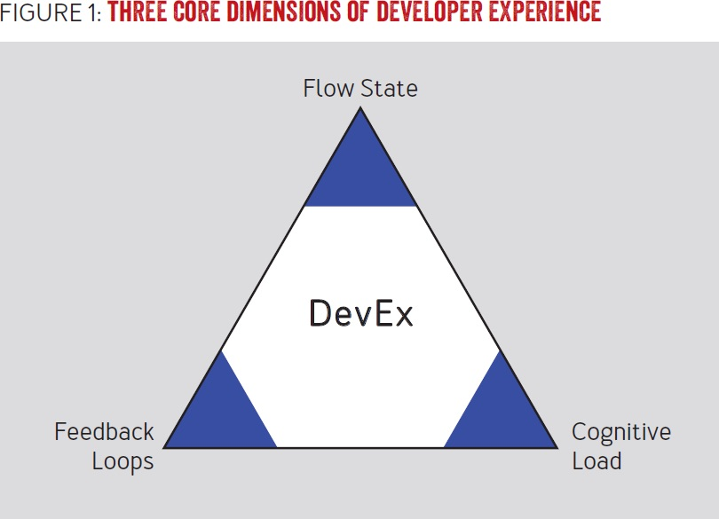
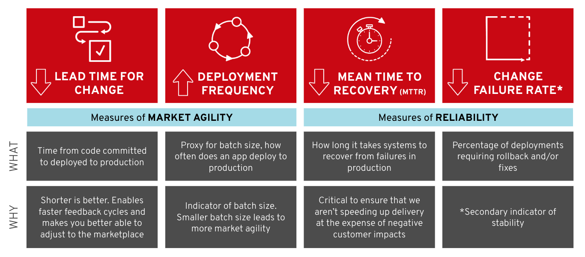
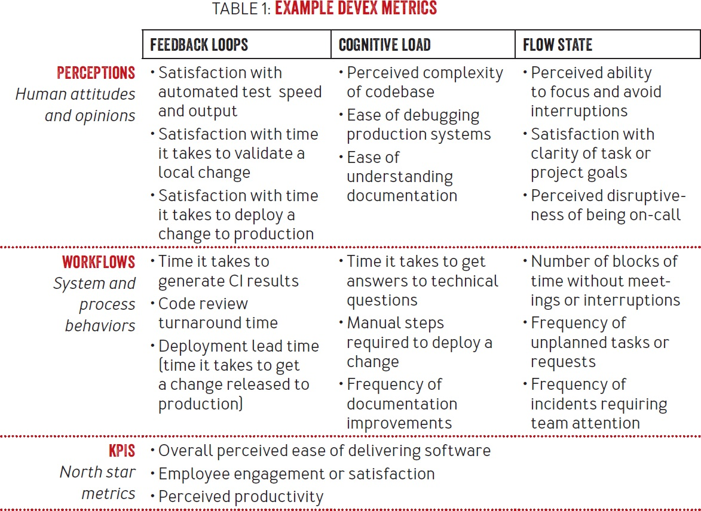
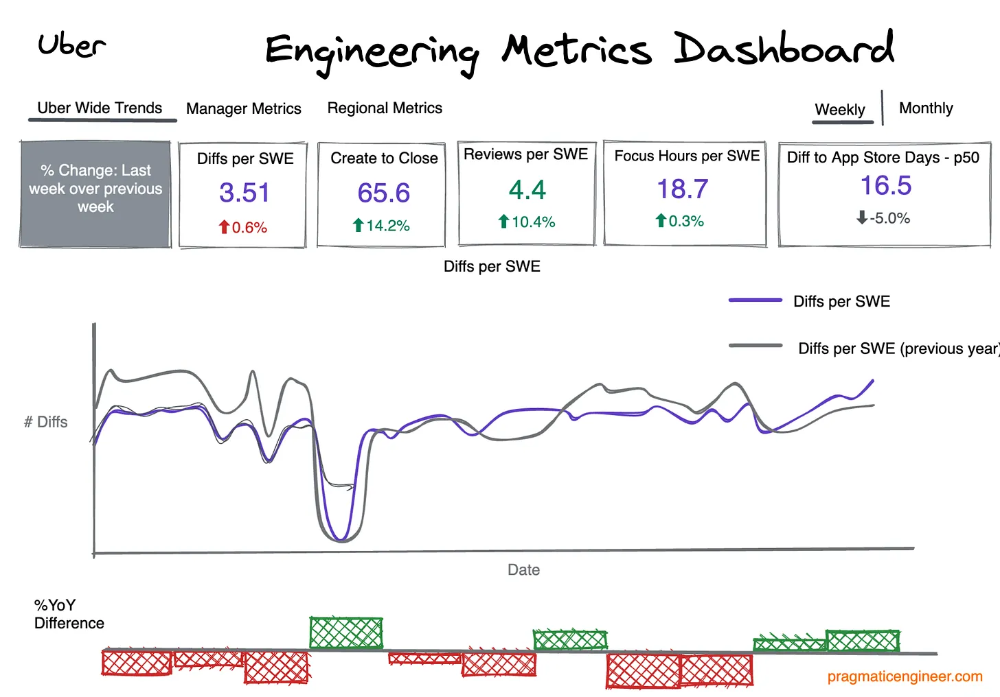

# Developer Productivity Engineering (DPE): Enhancing the Developer Experience

Developer Productivity Engineering (DPE) is an emerging practice in software development that focuses on enhancing developer productivity and experience. In an era where digital businesses are paramount, DPE has become a critical tool for companies aiming to develop high-quality software more efficiently while ensuring developer satisfaction.

DPE distinguishes itself from traditional productivity initiatives by adopting a technology-centered perspective and a data-driven approach. This involves identifying and addressing bottlenecks in the software development lifecycle, with a particular focus on minimizing waste and inefficiencies associated with software build and testing processes.

## Developer Productivity: An Evolving Landscape and Evidence-Based Understanding

Developer productivity is a constantly evolving field, recently redefined to encompass not just efficiency but also developer well-being and satisfaction. Influential studies, such as Google's 9th Annual State of DevOps Report, underscore this shift by measuring outcomes in terms of organizational performance, team empowerment, and employee well-being.

High-performing organizations that cultivate a generative organizational culture — characterized by high trust and fluid information flow — show a 30% increase in performance. This result translates to higher productivity and job satisfaction, as well as a decrease in burnout. The report concludes that culture is key, suggesting that developer productivity may be a byproduct of developer joy, which is influenced by the developer's experience with their tools and the organization's engineering culture.

The research "Are Happy Workers More Productive? The Mediating Role of Service-Skill Use" investigates the relationship between job happiness and performance, suggesting that positive attitudes, such as engagement and job satisfaction, build resources for future performance. This study found a moderate correlation between job satisfaction and performance, particularly in high-complexity jobs. It argues that the quality of work life, represented by job happiness, determines the quality of the seller-customer relationship, affecting sales success.

In the context of software development, these findings suggest that a more humanized approach focused on developers' well-being can lead to greater productivity and quality of work. Job satisfaction and happiness are not just desirable outcomes in themselves but also crucial factors influencing developers' effectiveness and efficiency. Empowering teams with excellent tools and fostering an incredible engineering culture, as highlighted by industry leaders like Atlassian's CTO, Rajeev Rajan, may be key to unlocking developer productivity.

## Key Components of DPE

- **Continuous Integration and Continuous Delivery (CI/CD)**: Implementing CI/CD pipelines ensures that code changes are integrated, tested, and delivered frequently, resulting in faster feedback cycles.
- **Code Quality and Automated Testing**: Maintaining high code quality is crucial. Practices such as code reviews, static code analysis, and automated testing are essential for minimizing bugs and technical debt.
- **Efficient Development Environment and Tools**: Providing a well-organized development environment and appropriate tools is fundamental to developer productivity.
- **Collaboration and Communication Platforms**: Effective communication and collaboration tools are essential to prevent misunderstandings and promote efficient collaboration.
- **Time Management and Focus Techniques**: Techniques such as the Pomodoro method or focused work help developers better manage their time and increase efficiency.
- **Data-Driven Decision Making**: Data analysis helps identify and resolve bottlenecks, inefficiencies, and areas for improvement.
- **Continuous Evaluation and Improvement**: Ongoing monitoring and regular evaluation of DPE practices are essential for refining and improving development processes.

## The Three Dimensions of Developer Experience (DevEx)

Developer experience (DevEx) is a crucial aspect of Developer Productivity Engineering. It is best understood by considering the specificities of different developer profiles as well as general organizational patterns. Our approach distills the developer experience into three main dimensions: feedback cycles, cognitive load, and flow state.

*Source: [DevEx: What Actually Drives Productivity](https://queue.acm.org/detail.cfm?id=3595878)*

### Feedback Cycles

- **Value Stream Optimization**: Software organizations often look for ways to optimize their value stream, reducing or eliminating delays in software delivery. This enables faster feedback and more effective learning about what is being built, which, in turn, allows for quicker course corrections.
- **Impact on Feedback Cycles**: Rapid feedback cycles allow developers to complete their work quickly and with minimal friction. Slow feedback cycles disrupt the development process, leading to frustration and delays.

### Cognitive Load

- **Inherent Complexity**: Software development is inherently complex, and the growing number of tools and technologies increases the cognitive load faced by developers. Cognitive load encompasses the amount of mental processing required for a developer to perform a task.
- **Reducing Cognitive Load**: To improve developer experience, teams and organizations should strive to reduce cognitive load by finding ways to eliminate unnecessary hurdles in the development process.

### Flow State

- **Total Immersion in Work**: The flow state describes a mental state in which a person performing an activity is fully immersed in a feeling of energized focus, full involvement, and enjoyment.
- **Facilitating the Flow State**: Frequent experiences of flow state at work lead to higher productivity, innovation, and employee development. Interruptions and delays are significant factors that impede a developer's ability to experience the flow state.

## DPE Frameworks and Metrics

### What is the SPACE Framework?

The SPACE Framework is a set of dimensions used to understand developer productivity. The dimensions include:

- **Satisfaction**: Refers to the well-being and contentment of developers.
- **Performance**: The efficiency and effectiveness of developers in their tasks.
- **Activity**: The level of engagement and activity of developers.
- **Communication and Collaboration**: The effectiveness of communication and collaboration within teams.
- **Efficiency and Flow**: The ability to work efficiently and in a state of "flow".

*Source: [The SPACE of Developer Productivity](https://queue.acm.org/detail.cfm?id=3454124)*

### DORA Metrics

DORA focuses on four key metrics to assess the performance of software development teams:

- Deployment frequency
- Lead time for changes
- Change failure rate
- Time to recover from failures

*Source: [Exploring a Metrics-Driven Approach to Transformation](https://www.redhat.com/en/blog/exploring-a-metrics-driven-approach-to-transformation)*

### Developer Experience (DX) Metrics

- **Developer Satisfaction**: Measures the level of satisfaction with the technology or platform.
- **Time to Onboarding**: Assesses the time needed for new developers to become productive.
- **Ease of Use**: Measures the ease of use of development tools.
- **Collaboration**: Assesses the level of collaboration among team members.
- **Code Maintainability**: Considers the ease of maintaining and updating existing code.
- **Tooling**: Evaluates the effectiveness of development tools used.

*Source: [DevEx: What Actually Drives Productivity](https://queue.acm.org/detail.cfm?id=3595878)*

## DPE in Action: Industry Adoption and Case Studies

Developer Productivity Engineering (DPE) is gaining prominence and adoption across various leading technology organizations. These case studies reveal a growing trend in the tech industry: a focus on enabling and improving the developer experience, rather than merely measuring output. This approach acknowledges that developer productivity is intrinsically linked to their satisfaction and well-being, and that a conducive work environment and efficient tools are key to fostering sustainable productivity.

### Google: Unlocking and Measuring Developer Productivity

Google approaches developer productivity through a dedicated engineering productivity research team. This cross-functional team conducts quantitative and qualitative research, focusing not only on the "how" but also the "why," "when," and "how much." They utilize various metrics and surveys, including engineering satisfaction and direct feedback from developers, to understand and optimize the developer experience.

### Netflix and Developer Productivity Engineering

At Netflix, the developer productivity team focuses on developer experience and enablement. The company utilizes the developer productivity SPACE framework, which considers socio-technical factors such as satisfaction, performance, activity, communication, collaboration, efficiency, and flow. Netflix also conducts regular surveys and collects qualitative feedback on the effectiveness of tools and internal support, seeking to understand and continuously improve the developer experience.

### Atlassian and Measuring Developer Joy

Atlassian advocates for measuring developer joy, rather than pure productivity. They offer monthly anonymous surveys and weekly CheckOps for their engineers. These assessments focus on aspects such as the developer's experience with tools and the engineering culture. Atlassian's CTO, Rajeev Rajan, emphasizes the importance of excellent tools, team empowerment, and fostering an incredible engineering culture to unlock developer productivity.

### Introduction to Uber's Eng Metrics Dashboard

Uber's approach to Developer Productivity Engineering (DPE) is highlighted by the launch of the Eng Metrics Dashboard. This tool, introduced by CEO Dara Khosrowshahi during an all-hands meeting, focuses on enhancing transparency and productivity within the engineering team by tracking various metrics related to pull requests (referred to as 'diffs' at Uber), code review metrics, and focus time stats.

#### The Dashboard: Key Features and Metrics

The Eng Metrics Dashboard provides a comprehensive view of engineering productivity through the following metrics:

- **Pull Review Metrics**: Tracks the volume and efficiency of pull requests, offering insights into the code integration process.
- **Code Review Metrics**: Assesses the quality and speed of code reviews, emphasizing the importance of peer feedback in maintaining code quality.
- **Focus Time Stats**: Highlights periods of uninterrupted work, underlining the significance of dedicated focus time for complex problem-solving and coding tasks.

*Note: The above image is a mock-up for illustration purposes and does not reflect Uber's internal data.*

Uber's dashboard initiative aligns with broader industry trends towards quantifying and enhancing engineering productivity. By focusing on key performance indicators, Uber seeks to balance the demands of rapid development cycles with the need for high-quality, maintainable code. This approach reflects a maturation of DPE practices, emphasizing the role of metrics in facilitating effective management and continuous optimization of the software development lifecycle.

## Useful Links

- [Are Happy Workers More Productive? The Mediating Role of Service-Skill Use](https://www.frontiersin.org/articles/10.3389/fpsyg.2020.00456/full)
- [2023 State of DevOps Report](https://cloud.google.com/devops/state-of-devops)
- [DevEx: What Actually Drives Productivity](https://queue.acm.org/detail.cfm?id=3595878)