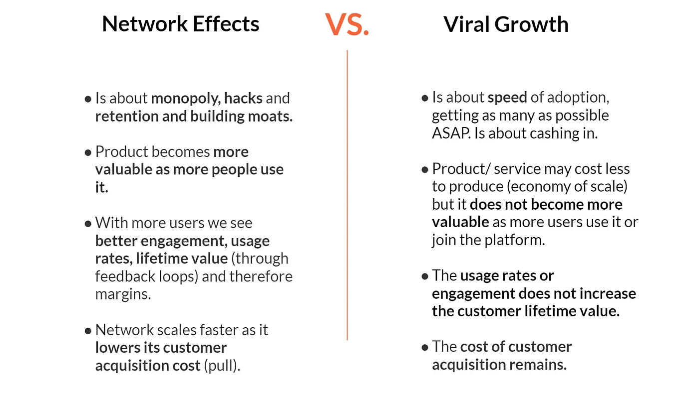

# Harnessing Network Effects: The Digital Growth Catalyst

In the digital realm, where competition and innovation move at **breakneck speed**, understanding and leveraging network effects (NFX) is not just strategic—it's existential. This article delves into the essence of network effects, distinguishing them from other growth phenomena like virality, and presenting a strategic framework for activating and sustaining these effects to secure competitive advantage and market dominance.

## Introduction

In the evolving digital ecosystem, the concept of network effects stands as a cornerstone of platform success and defensibility. Originating from the interconnectivity and collective value generated by users, network effects have propelled the exponential growth of technology platforms since 1994. Recognized in James Currier’s NFX Bible as a primary driver of value creation in technology, understanding, distinguishing, and activating network effects is crucial for entrepreneurs and investors alike. This article aims to unfold a strategic blueprint for identifying and leveraging network effects, emphasizing their critical role in enhancing platform robustness, user engagement, and long-term viability.

## Network Effects: The Engine of Digital Evolution

The advent of digital technology has fundamentally shifted the paradigms of value creation and growth expectations. Unlike the industrial era's focus on production efficiency and economies of scale, today’s digital platforms thrive on connectivity, interaction, and mutual value creation between users. Network effects embody this shift, serving as a dynamic force that amplifies a platform’s value with each new user.

- **Technology and Automation**: How advancements have reshaped market dynamics.
- **Global Connectivity**: The role of interconnectedness in facilitating network effects.
- **User-Centric Growth**: The importance of user engagement in amplifying platform value.

## Distinguishing Network Effects from Virality

While both network effects and virality can propel rapid platform growth, they operate through fundamentally different mechanisms.

- **Network Effects**: Enhance a platform’s value and defensibility by deepening user engagement and expanding the service’s utility with each additional user.
- **Virality**: Focuses on the speed of user acquisition, often without a corresponding increase in value for existing users.

Essentially:

network effects are about retention, monopoly, hacks, and defensibility while viral growth is about the speed of adoption;
network effects become more valuable as more people use it while viral growth may produce a cost-benefit through economies of scale but not necessarily making the product or service more valuable to the people subscribing to it;
as the network/platform grows we see more and better engagement, user rates and more customer lifetime value while viral growth there is no correlation that more use leads to more customer lifetime value;
as the network/platform scales, network effects produce better margins due to a reduction in customer acquisition cost with a trend leading to zero and activating pull. On the other hand viral growth, there is still an expense for customer acquisition and as it occurs, often there is a limit for virality as certain products or services tend to lose its attractiveness after a period of success over a period of time.

The “Laws” of Network Effects and the Struggle between Abstractions and Reality
Several researchers have been studying this phenomenon within time. In particular Sarnoff, Metcalfe and Reed’s work gave us clarity on how network value grows in relationship with the network size and shape. The so-called Network Effects Laws, are not immutable and are not necessarily present as such in our complex reality, especially when talking about far-reaching digital networks, which are often multi-sided with nuggets of influence of asymmetric value where often participants act as a supply and other times as demand-side (think of an Airbnb host who sometimes is a guest).

These “Laws” are great at helping us picture how the different types of networks create value; but — in reality — networks are much messier, asymmetric and chaotic. It is hard to find networks that have such perfect forms and symmetric relations among participants: therefore the laws should not be taken as immutable frames but more as ways to identify how in a certain part of the network is behaving especially since very often more than one “law” is present in a network.

Furthermore, besides the key driver of the network effect, an important factor to consider is the growing depth and the available choice of the offering and the way the entities are connected. How they influence, contribute and reinforce the value growth with size and participation.

We could call these further value drivers “reinforcing” mechanisms. As an example, the more data is available on a network, the more the platform can train an AI system to be able to become prescriptive and help the participants navigate the complexity of the network or execute particular strategic actions. As another example, the more a solution becomes embedded into the business process of many players, the harder to switch to another solution for participants. Also, network growth can as well produce traditional economies of scale for the owner of the platform and therefore generate savings for participants as the network grows.

This improved perception of value is key as it makes the cost of customer acquisition for platform organizations (that are network effects based), decrease over time, in comparison to traditional products.

Here above we present some typical reinforcing effects — taken from the excellent blog post from Max Olson cited in the opening — to explain some of these reinforcing effects through the illustration of flywheels, and interesting and a truly useful way to picture network effects as a virtual cycle that reinforces itself.

The original post has very interesting illustrations of Amazon’s and Google’s network effects and reinforcing mechanisms, and we share here the example of Airbnb.

As one can see from figure 1, all starts with a 2-sided network effect. Then suddenly the brand value proposition perception increases as a reinforcing mechanism (figure 2). In figure 3 we highlight how the technology becomes better thanks to increasing access to data, and finally, in figure 4 we explain how the existing demand allows Airbnb to introduce an integrative business model, experience hosting.

Critical Mass & the Chicken-and-Egg Problem
Whoever has been dealing with a network effect dependent venture must know what does it mean to aim for critical mass to be reached. Often it means lots of cash in investments until reaching it or painfully giving up. Therefore understanding what it is and what is involved can be of use.

Critical Mass is often described as the number of participants or size of the network needed to allow the platform itself to auto-generate its own growth — essentially by having a value perception that grows faster than the growth of the network — . Critical Mass can be understood as a tipping point or threshold where a notorious change in the trajectory of a growth curve occurs and a significant increment in the value of the network happens. We’ve been covering the concept of achieving liquidity (a concept overlapped with critical mass) on two previous posts, and we definitely suggest the reader give them a read in parallel with this recap we’re offering today.

For early-stage networks, reaching this point becomes existential, especially for two-sided marketplaces where is important to attack both sides of the network. Often referred to as the Chicken-and-Egg problem is the endless chase to find out how to kick-start the flywheel when you need multiple sides of the ecosystem to join and interact through the platform. To give a quick example, OpenTable found out that they needed to have about 25 restaurants in any given city to be attractive enough for guests and use the booking service, while for Airbnb, the quasi-magic number was 300 homes per city.

Network Properties
To understand which mechanisms will impact positively the growth of our network-platform and will facilitate reaching critical mass, we need to know deeply how the nature and behavior of the participants interrelate with the Value Proposition perception of the Platform. In particular, there are five essential aspects we’d like to focus on.

One thing that we need to keep in mind is that often when we refer to these properties, it’s easier to explain them — and most likely to understand them — in relation to a two-sided marketplace-platform while, in reality, opportunities for development of platform strategies increasingly relate with more complex multi-sided systems where multiple two-sided relationships overlap. Let’s keep this in mind when analyzing our system.

Commoditized or Differentiated Supply
How easy is it to replicate the offering among the suppliers? This is a key question to ask. As an example while Airbnb hosts offer places to stay that are partially unique (at least in terms of position, if not vibe or host reputation) — and this is increasing with experience hosting — Uber drivers are easily replicable since the value one gets is that of getting from A to B. One could reflect on the infamous quote from Travis Kalanick thinking about replacing “the dude in the car” with an AI. Having a commoditized supply normally creates a so-called “asymptotic” curve in network effects: in a commoditized supply marketplace, the value reaches a plateau at some point even when adding more depth to the offering. If the offering is commoditized how much you can improve while still adding value? Once you have a car coming up in 3 minutes, having it in 2 doesn’t really change your life.

Symmetry or Asymmetry of the Supply / Demand
Most of the networks have asymmetric weights of their supply and demand Asymmetry can offer a good hint in choosing what side one should attract first (we’ll talk about this later in more details): as an example, given that one expert content provider can attract many thousands of learners, online learning platform Masterclass is choosing to manually curate the list of first-class teachers (“learn from the best”). Similarly, when Apple launched the iPhone, the company self-developed a number of key applications — knowing that there was no real economic potential for mobile app development — to later open access to developers when the number of users was substantially grown. Essentially Apple was subsidizing the supply slide.

Normally the asymmetry of the capability of producers to serve also impacts the behavior of network effects in a way to anticipate the plateauing and, on the other hand, anticipates the achievement of the liquidity: it’s easy to explain why on marketplaces asymmetric on the supply side (with the supply side able to serve a disproportionate amount of demand) shapers tend to attract supply first. A powerful way to attract supply-side — or in general the most important of the sides — may be that of providing them with so-called single-user-value: a value proposition that doesn’t necessarily need the network effect to exist. As an example, despite in the very early days, OpenTable traction was small, the free tools to manage the bookings were convincing enough for the restaurants to join the platform.

Flexibility of Location: Locally or Globally Bound
The supply and demand of a network are also more or less attached to a certain location. Sometimes networks are highly local, other times demand (or supply) can consume or serve a more larger network. Let’s take the example of the French platform “The Food Assembly / La Rouche qui dit Oui”: in this case, the network of food producers, food buyers and community organizers is heavily local (basically city-region bound) making this a disconnected local network. In the case of Airbnb instead, the traveler can travel and “spillover” the value from one city to another: a traveler can discover the possibility to be a host and effectively trigger internal growth. In other cases, let’s think for example about gig worker platform Fiverr, most of the work can be performed online, making the network effectively global.

Quite intuitively the more a network is locally bounded, the more it will be hard to achieve liquidity — if one looks on a global scale. More precisely, the concept of liquidity in a heavily local network must probably be reimagined as a sum of different liquidity/critical mass events at a local level. The question will be that of understanding what and when the value from a (local) sub-network can spill over the larger network of networks.

When you have a local network — especially with interconnected local networks — a particular strategy called “bowling pin” may come handy in achieving liquidity. This strategy consists of launching different cohort-networks gradually and extending to the others “like a bowling strike that gets all the pins”. It’s common for geographically bounded strategies: Airbnb launched city by city, Facebook started from Harvard. A bowling pin strategy can also work for tribal differences (e.g.: from rock music to all music).

Single Tenancy or Multi-tenancy
Multi-tenancy is when participants from the supply and/or the demand side may tend to juggle on multiple platforms to get out most of the value. Uber drivers are free to use two or more (Uber/Lyft/Juno) platforms that offer a similar service to extract as much value as possible. Airbnb hosts can — as well — list their properties on Booking and other platforms. This happens more often if the offering is commoditized. On the other hand, sometimes artificial constraints exist to prevent such behavior. This often happens when a public, regulated service is “platformized” by institutional players. As an example, Taxi drivers that are part of Rome’s biggest Taxi cooperative can only use an official platform and can’t, for example, join the FreeNow platform. Supporting Multi-tenancy often helps achieving liquidity faster: as suppliers are not “bounded” to one single platform they’re, on one hand, less concerned about joining yours as the opportunity-cost ratio may be higher and, on the other hand, if multi-tenancy is the industry standard suppliers do not disappear from availability once they join one network.

Transaction Frequency and Lifetime
Another key property of networks is the frequency of the transactions. In multi-sided systems, transaction frequency might vary — depending on what relationship we’re focusing on and to what sides of the system. As an example there’s a relevant difference in frequency of interactions between a real estate agency and a buyer in a real estate network: while from the point of view of the buyer the transaction is — often — very sparse in a lifetime, the real estate agency aims at increasing the transaction frequency as this represent its key value generator. When we look into a multi-sided network or — evermore — in market-network as James Currier once defined them, we may want to look at liquidity and critical mass as achievable separately — or relatively separately — looking at the different relationships. If one looks into the supply side, a supply-side that works on high-frequency transactions remain available in the network after a transaction is performed, in case our network instead is based on low-frequency transactions — on both sides — it may be challenging to achieve liquidity since a continuous outflow of entities would be hard to contrast with pull. The reader should vary of trying to organized ultra low-frequency markets — where both sides are transacting rarely — as this may be a signal of such a high transaction value that may make the case for a platform organized marketplace (that is promised on reducing transaction cost) not so applicable.

In the following picture, we give the reader a quick and — rather generic — highlight of how the properties we mentioned potentially impact the network effect “function”. As anticipated, a heavy local network and single tenancy may slow down acquiring liquidity while asymmetry (towards supply) and high frequency (o the supply side) normally help anticipate liquidity but also contribute to asymptotically plateauing perceived value.

Commoditized supply is also normally related to asymptotic network effects.

Conclusions and Further Considerations
In a world of plummeting coordination costs, mastering the basics of network effects is an increasingly important skill, independently from your intention, goals or priorities. It is though a subject full of mystique since it gets to us as a result of great narratives and success stories.

Network effects are essential to the contemporary theory of the organization especially the interconnected society we live in. Understanding the basics of Network effects is functional to play with the advancements we’re seeing in technologies such as AI or the blockchain — as highlighted years ago by 
Chris Dixon
 in his famous reflection on blockchain-based tokens — new tools to help us overcome the challenges of launching and getting to liquidity.

We hope that this piece will help you grasp better the key concepts and support you in identifying and activating the mechanisms driving the NFX in your platform/network. New content and examples will come upon this blog to offer you further guidance and inspiration.

Some of the most powerful and fastest-growing companies are based upon Network Effects. That makes this an exciting topic—to find out what’s behind Apple’s app ecosystem, Facebook’s social content, and Airbnb’s community.

Here’s what’s coming up in this Edition of Evergreen:

Distinct Types of Network Effects — yes, there are types
What Network Effects are Not — don’t get it twisted
Why Network Effects are powerful
How to Create Network Effects
What Exactly are Network Effects?
Network Effects were not really ‘a thing’ until we started to build a layer of technology for communication around our planet. It was coined in the early 1970's as academics began to study the growth of the telephone network.

Here is the best definition I could find of Network Effects:

A product displays positive network effects when more usage of the product by any user increases the product’s value for other users (and sometimes all users).

This is a more precise definition than many others floating around because of a few key concepts:

Distinguishing positive (there are negative as well, which we’ll get to)
‘Usage’ rather than ‘adding a user’ (which implies all users are identical)
Types of Network Effects
There are different ways that Network Effects can exist, and their dynamics change depending on the application. These concepts are often mistakenly conflated into ‘Network Effects’. Work to understand the differences, because they are not conceived the same way, and they don’t create the same results. This short breakdown from the Stern School of Business (NYU) defines the types of Network Effects:

Direct Network Effects:

The simplest network effects are direct: increases in usage lead to direct increases in value. The original example of telephone service is a good illustration of a product that displays direct network effects.

Indirect Network Effects:

Network effects may also be indirect, where increased in usage of the product spawns the production of increasingly valuable complementary goods, and this results in an increase in the value of the original product. For instance, while there are some direct network effects associated with Windows, the indirect network effects that arise from the increased quality and availability of complementary applications software are probably much more important.

Two-sided Network Effects:

Network effects can also be two-sided: increases in usage by one set of users increases the value of a complementary product to another distinct set of users, and vice versa. In many cases, one may think of indirect network effects as a one-directional version of two-sided network effects.

This is the type of Network Effect that defines Marketplaces such as Airbnb, Uber, and Zaarly. More riders does not necessarily improve my Uber experience but it does attract more drivers, which will improve Uber for me.

[If you happen to be working on a Marketplace or interested in them, this is an important core concept to understand. Here are two more great resources on this topic, specifically: Strategies for two-sided markets, and Jean Tirole on Platform Competition. Both valuable contributions by Karthik Rajeshwaran]

Local Network Effects:

The microstructure of an underlying network of connections often influences how much network effects matter. For example, a product displays local network effects when each user is influenced directly by the decisions of only a small subset of other users — those they are “connected” to via an underlying social or business network.

Zaarly is also a good example of this: A new Homeowner who joins in Denver contributes to the Denver Network Effect, and does not influence the quality of the experience for Homeowners in Austin.

Instant messaging is another great example of a product that displays ‘local’ network effects which are social rather than geographical.

What Network Effects are Not
In addition to being conflated amongst themselves, Network Effects are also conflated with other adjacent concepts in business. To understand any concept well, it’s helpful to understand what it is Not.

Network Effects are Not Virality
A viral product is one whose rate of adoption increases with each additional user. The more people join, the faster it grows — until a certain point. They’re often confused because both Network Effects and Virality increase growth of a business and it’s value as new users join. However, they are completely independent concepts, as we see here:

There are products that exhibit virality without exhibiting network effects. A case in point being email and cross-platform communication products. A key feature here is that they are either interoperable across networks (Hotmail) or leverage an underlying network for both the viral transmission as well as delivery of the value proposition. In the case of SurveyMonkey, EventBrite etc., that underlying network may be mail, a social network or even a blog.

There are others that exhibit network effects without exhibiting virality. Products with indirect network effects such as marketplaces may not grow virally. In such cases, network effects are a result of aggregation of the two sides and while each side can be brought on virally through some incentive, it’s very difficult to leverage the indirect network effect to get users on one side to come on through invitations or interactions from the other side.

Here’s a graphic that shows some examples of each of these concepts independently, as well as companies that have both:

Thanks to Karan Khandpur for suggesting the great post with these ideas!

Network Effects are Not Economies of Scale
Economies of Scale arise (and there’s a whole separate Edition to come on this) when there’s sufficient volume of production to massively reduce the costs, so the largest player can maintain the best margin of profitability.

Network Effects are distinct from Economies of scale because they produce greater value for the marginal increase in cost. As Networks grow larger, the cost increases, but the value of the product increases faster.

The fact that Apple sells a lot of iPhones does not mean that it has Network Effects, just Economies of Scale. The fact that people want to buy it so that they can use iMessage with their friends — that’s the Network Effect.

Why Network Effects are Powerful
To the fun part — how to create Network Effects, and benefit from their incredible power to extract value. Let’s start with the Endgame.

Why Networks create so much value
There is one graphic that conveys the full concept of Network Effects. It was contributed by Ray Stern, who created it when he was training employees as CMO of Intuit. Take it all in…

This visual showed me the value of Network Effects more clearly than all of the other posts and papers out there. The heart of the power of Network effects is right here: Value Increases Exponentially — Costs increase Linearly.

The cost of maintaining the network does not grow as fast as the value of the network. The value increases as the size of the network increases.

The implication is a principle that anyone operating in an industry influenced by Network Effects should understand: in the long run, there will tend to be fewer players, and they will continue to grow larger.

“You can suck at everything and still make money”
Another reason that Network Effects are so valuable is that they don’t require a ton of maintenance. Once they’re built, they tend to perpetuate themselves. Even if they’re managed completely incompetently. To paraphrase Warren Buffett: “It’s great to own a business that a monkey could run — because sooner or later, one will.”

Here’s what James Currier learned from his time working at Monster.com:

In every element of the business other than the sales team, this was a poorly run company. I don’t think they had changed the website in two years. Poor product, poor customer service, poor strategic decision making, and from what we could tell, a lack of insight into what was about to happen to them because of LinkedIn and others.

What stood out was that none of this mismanagement mattered. They had a network effect in place. Like Craigslist, the only feature that mattered was that everyone was there. The buyers found efficiencies in using them and so did the sellers. Both sides of the marketplace kept coming, and Monster kept making money.

That sounds like a good business to run — lots of margin for error, which is a great asset. We should all aspire to start businesses where we can suck at everything and still make money. (Then if we don’t — it’s all upside!)