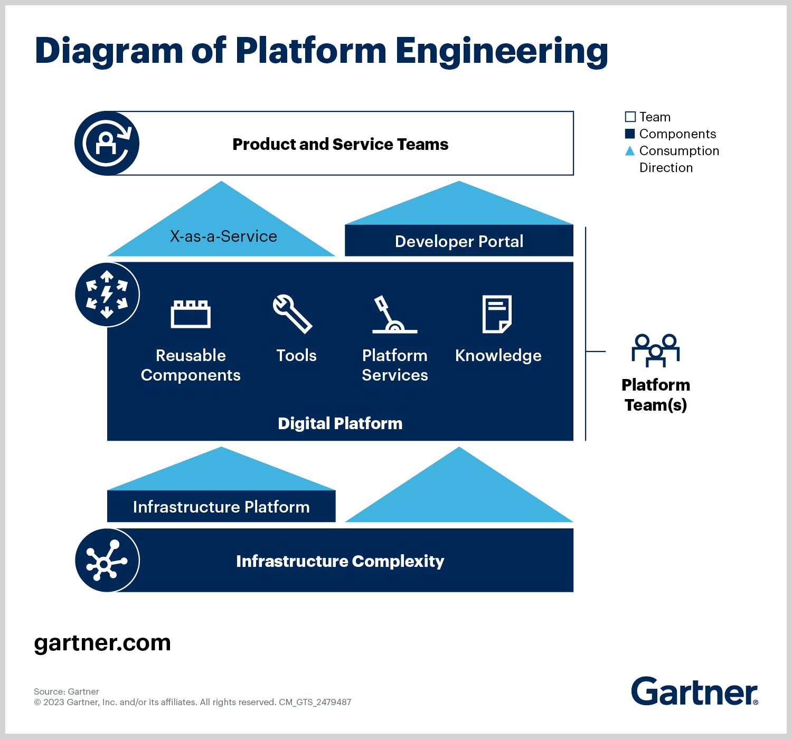
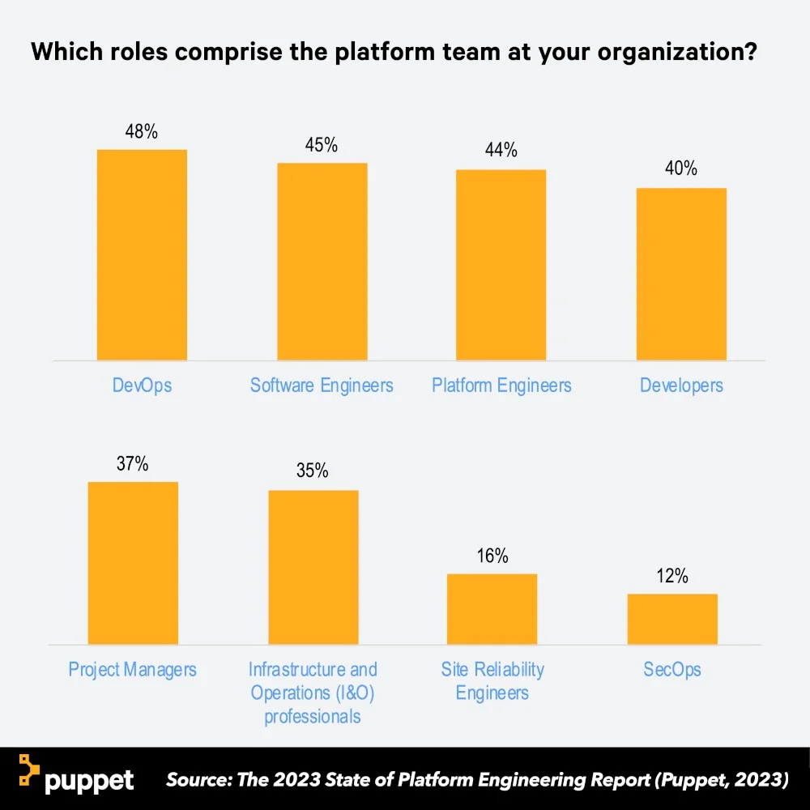
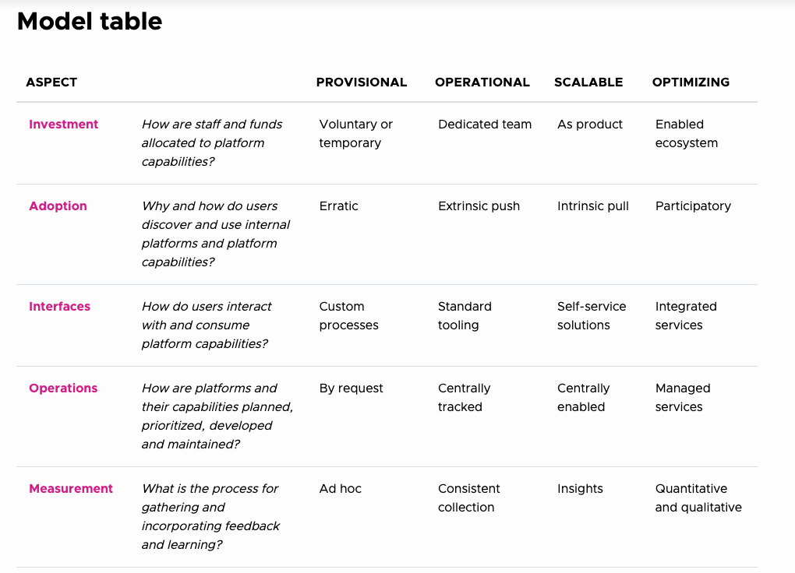
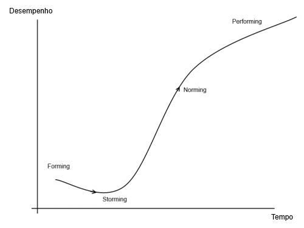

# How to Build a Platform Team: Strategies, Stages, and Solutions

## Introduction

The creation of a dedicated platform team has become an imperative for organizations striving to harness the full potential of cloud technologies and digital services. Such teams face a multitude of challenges and opportunities, each demanding a distinct set of skills and strategic approaches. The Internal Development Platform(IDP) has emerged not just as a piece of the IT infrastructure, but as a pivotal business asset that can dictate the speed and direction of an organization’s growth. Building a platform team, therefore, is about curating a group of professionals adept at navigating this complex landscape and capable of transforming technological capabilities into tangible business outcomes.

Platforms are the linchpins of modern digital strategy, pivotal in catapulting enterprises to new heights of efficiency and market reactivity. They amplify developer productivity, cut down product time-to-market, and ensure application robustness. This digital backbone not only supports but actively enables business agility and a competitive edge essential for success in the digital arena. By integrating development and operational capabilities into a seamless experience, platforms act as a catalyst for innovation, with platform teams at the helm, orchestrating the technological symphony that drives business forward.

## Defining a Platform Team

A platform team is a diverse collective, where platform architects, developers, operations engineers, and product managers converge with a shared mission: to construct a robust platform architecture that marries technical prowess with the organization’s strategic imperatives. It is this cross-functional nature that equips the team to craft platforms that are not only technologically sound but also serve as a springboard for business innovation and strategy execution.

Such teams are indispensable in the digital ecosystem; they are the masterminds behind the digital foundation that supports and propels business strategies. By adeptly marrying technology with business acumen, platform teams empower organizations to embrace technological advances, adopt agile business models, and swiftly adapt to the ever-changing market dynamics. In doing so, they are not merely participants but are pivotal drivers of innovation and competitive prowess in the digital marketplace.

### Essential Roles and Focus

Assembling a platform team is akin to assembling a high-caliber crew for a complex, evolving product—your Internal Developer Platform (IDP). This ensemble of roles is orchestrated to deliver a unified outcome: a robust, scalable, and user-centric platform. Here’s a snapshot of the key players and their roles:

- **Platform Engineering Lead (PEL)**: This leader serves as the team's compass, setting the strategic direction and ensuring the platform reflects and enhances organizational goals. Like a conductor in an orchestra, the PEL synchronizes all aspects of the platform's performance.

- **Platform Engineers**: They are the architects and builders, translating the PEL's vision into a tangible framework that supports scalability and innovation. Their hands craft the platform's core, from code to deployment.

- **Site Reliability Engineers (SREs)**: The guardians of the platform's reliability, these engineers weave resilience into the platform's fabric, ensuring uptime and seamless performance that users can depend on.

- **Security Specialist**: A dedicated security expert is no longer optional but a necessity. This role is responsible for embedding security into the platform's DNA, ensuring compliance with the latest standards, and safeguarding against evolving threats.

- **UX/UI Designers**: These designers are instrumental in creating an intuitive and accessible platform. They ensure the interface is not just functional but a delight to use, reflecting Jobs' own ethos for user-centric design.

- **Technical Writers**: Communicators par excellence, they provide the clear, concise documentation that is the hallmark of any user-focused product. Their role is crucial in educating and engaging the platform's users.

- **Quality Assurance Lead**: This role is focused on ensuring the platform operates flawlessly, coordinating testing activities and validating that the platform functions meet the intended design and user requirements.

- **Developer**: The builders of the platform, developers translate requirements into functionality, embodying the creative spirit that drives platform innovation and evolution.

- **Executive Sponsor**: This senior leader steers the strategic roadmap of the platform, aligning it with measurable business outcomes and championing its relevance within the enterprise. They are the bridge between the platform's tactical needs and the company's strategic aspirations.

These roles form the backbone of a platform team geared for impact. Each role is crucial, stripping away any superfluous functions to focus on delivering a platform that not only meets the present technical specifications but also is poised to evolve with the organization's future needs.

## Measuring Success: KPIs for Platform Teams

In platform engineering, success is quantified by key performance indicators (KPIs) that reflect the team's efficiency, security, and impact across the organization. The following KPIs, complete with their formulas, serve as benchmarks for a platform team's performance:

### Speed of Product Delivery

- **Deployment Frequency (DF)**: The number of deployments over a given time period.
  - `DF = Total Deployments / Time Period`
- **Lead Time for Changes (LTC)**: The time it takes for a commit to be deployed into production.
  - `LTC = Time of Deployment - Time of Code Commit`
- **Mean Time to Resolution (MTTR)**: The average time to recover from a failure.
  - `MTTR = Total Downtime / Number of Incidents`

### Developer Productivity

- **Code Churn**: The percentage of code changes that are subsequently modified or deleted within a short time frame.
  - `Code Churn = (Lines Changed Again / Total Lines Changed) * 100`
- **Feature Completion Rate (FCR)**: The ratio of features completed to the total features planned within a sprint or release cycle.
  - `FCR = (Completed Features / Planned Features) * 100`

### Improved Security and Compliance

- **Incident Volume & Severity (IVS)**: The count of security incidents and their severity over time.
  - `IVS = Sum of Incident Severity Scores / Total Incidents`
- **Continuous Compliance (CC)**: The percentage of time the platform remains compliant with defined standards.
  - `CC = (Time in Compliance / Total Time) * 100`
- **Resolution Speed (RS)**: The average time taken to remediate security vulnerabilities.
  - `RS = (Total Time to Remediate / Number of Remediated Vulnerabilities)`

### Supported Infrastructure

- **Platform Adoption Rate (PAR)**: The extent to which the platform is used within the organization.
  - `PAR = (Number of Teams Using the Platform / Total Number of Teams) * 100`
- **Time Saved Through Automation (TSA)**: The reduction in time spent on tasks due to automation.
  - `TSA = (Time Before Automation - Time After Automation)`

### Role-Specific Metrics for Developers

- **Productivity Improvement (PI)**: The increase in the number of tasks or features completed over time.
  - `PI = ((Features Completed After - Features Completed Before) / Features Completed Before) * 100`
- **Quality of Software (QS)**: Measured by the reduction in the number of defects post-deployment.
  - `QS = (Defects Before - Defects After) / Defects Before`
- **Reduced Lead Time for Deployment (RLTD)**: The decrease in time from code commit to production.
  - `RLTD = (Lead Time Before - Lead Time After) / Lead Time Before`
- **Application Stability (AS)**: The decrease in the frequency of application crashes or downtime.
  - `AS = (Downtime Before - Downtime After) / Downtime Before`

### Internal Customer Satisfaction

- **Net Promoter Score (NPS)**: A metric to gauge the loyalty of platform users and their likelihood to recommend the platform to others.
  - `NPS = (% Promoters - % Detractors)`
- **Feature Usage Rate (FUR)**: The percentage of active users utilizing specific features of the platform, indicating their value and adoption.
  - `FUR = (Number of Users Using Specific Feature / Total Number of Active Users) * 100`

Each KPI offers a lens through which platform teams can introspect and iterate on their practices to optimize platform services, ensuring they align with the organization's digital ambitions and deliver exceptional value to end-users.

## Introduction to the Maturity Model

The Platform Maturity Model provides a scaffold for understanding the evolutionary stages of platform development within an organization. It delineates a progression across four distinct levels—Provisional, Operational, Scalable, and Optimizing—each characterized by specific attributes in investment, adoption, interfaces, operations, and measurement.

### Levels of Maturity

#### Provisional

At this foundational level, platform teams respond to immediate needs with voluntary or temporary investments and erratic adoption patterns. Custom processes mark the interfaces, with operations being request-driven and measurement largely ad hoc.

- **Investment**: Staff and funds are allocated to platform capabilities on a voluntary or temporary basis.
- **Adoption**: User discovery and use of internal platforms and capabilities are erratic.
- **Interfaces**: Users interact with platform capabilities through custom processes.
- **Operations**: Platforms and capabilities are planned, prioritized, developed, and maintained by request.
- **Measurement**: The process for gathering and incorporating feedback and learning is ad hoc.

#### Operational

The dedicated platform team emerges, characterized by a consistent collection of feedback and a centrally tracked operation. Adoption requires an extrinsic push, and standard tooling begins to define the interfaces.

- **Investment**: A dedicated team is established for platform capabilities.
- **Adoption**: There is an extrinsic push to drive users towards the platform.
- **Interfaces**: Standard tooling is established for interaction with platform capabilities.
- **Operations**: Platform-related operations are centrally tracked.
- **Measurement**: Feedback and learning are incorporated through consistent collection methods.

#### Scalable

Platforms evolve into products at this stage, supporting self-service solutions and centrally enabled operations. Adoption shifts to an intrinsic pull as developers are drawn to the platform's efficiency and capabilities, and insights drive measurement practices.

- **Investment**: Platform capabilities are treated and managed as products.
- **Adoption**: Users are intrinsically pulled towards using the platform.
- **Interfaces**: Self-service solutions are available for user interaction with platform capabilities.
- **Operations**: Platform and capability operations are centrally enabled.
- **Measurement**: Insights are gathered to inform the platform's development and optimization.

#### Optimizing

In the most advanced stage, the platform team enables an ecosystem with integrated services, participatory adoption, and managed services. Measurement is both quantitative and qualitative, reflecting a deep understanding of platform impact.

- **Investment**: An enabled ecosystem supports platform capabilities.
- **Adoption**: Platform use becomes participatory, with active user involvement.
- **Interfaces**: Integrated services streamline how users consume platform capabilities.
- **Operations**: Managed services underpin platform operations.
- **Measurement**: A combination of quantitative and qualitative methods are utilized for feedback and learning.

## Stages of Team Development: Tuckman's Model & Overcoming Common Challenges: Lencioni's Five Dysfunctions

- **Forming**: Introduce the initial stage where team members come together, focusing on orientation and relationship building.
- **Storming**: Address the challenges and conflicts that arise as team members start working together and establish processes.
- **Norming**: Describe how teams develop norms, establish roles, and begin to work more cohesively.
- **Performing**: Highlight the stage where the team reaches optimal functionality and efficiency.
- **Adjourning**: Mention this final stage, focusing on project completion and team disbandment or transformation.

Identify common obstacles faced by organizations when implementing platforms, such as balancing autonomy with governance, ensuring platform adoption, and demonstrating the platform's value to leadership for sustained support.

- **Absence of Trust**: Explore strategies to build trust among team members.
- **Fear of Conflict**: Discuss the importance of fostering healthy debates and resolving conflicts constructively.
- **Lack of Commitment**: Provide insights on achieving team alignment and commitment to decisions.
- **Avoidance of Accountability**: Highlight approaches to encourage personal responsibility and accountability.
- **Inattention to Results**: Emphasize the need to focus on collective outcomes over individual achievements.

## Conclusion

Summarize the key points covered in the article and reinforce the importance of deliberate and strategic efforts in building and managing a platform team. Encourage leaders to apply these insights and frameworks to enhance their team's effectiveness and contribute to their organization's success.
