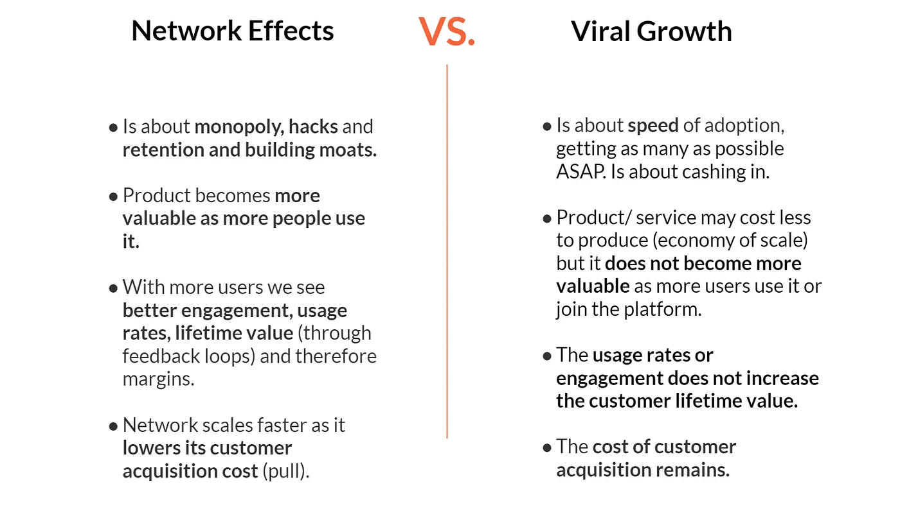
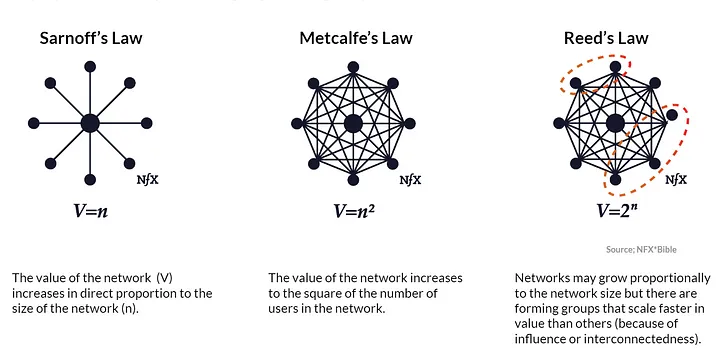
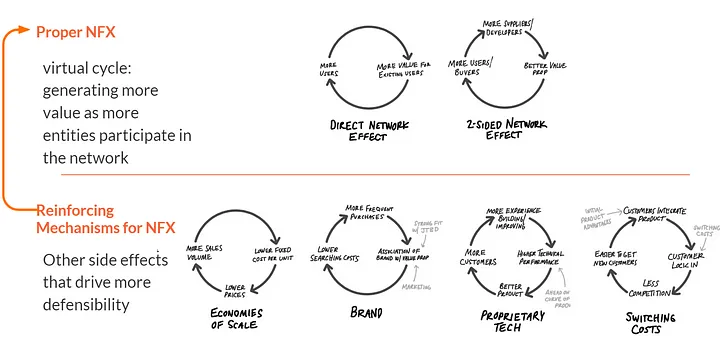

# Harnessing Network Effects: The Digital Growth Catalyst

In the digital realm, where competition and innovation move at **breakneck speed**, understanding and leveraging network effects (NFX) is not just strategic—it's existential. This article delves into the essence of network effects, distinguishing them from other growth phenomena like virality, and presenting a strategic framework for activating and sustaining these effects to secure competitive advantage and market dominance.

## Introduction

In the evolving digital ecosystem, the concept of network effects stands as a cornerstone of platform success and defensibility. Originating from the interconnectivity and collective value generated by users, network effects have propelled the exponential growth of technology platforms since 1994. Recognized in James Currier’s NFX Bible as a primary driver of value creation in technology, understanding, distinguishing, and activating network effects is crucial for entrepreneurs and investors alike. This article aims to unfold a strategic blueprint for identifying and leveraging network effects, emphasizing their critical role in enhancing platform robustness, user engagement, and long-term viability.

## Network Effects: The Engine of Digital Evolution

The advent of digital technology has fundamentally shifted the paradigms of value creation and growth expectations. Unlike the industrial era's focus on production efficiency and economies of scale, today’s digital platforms thrive on connectivity, interaction, and mutual value creation between users. Network effects embody this shift, serving as a dynamic force that amplifies a platform’s value with each new user.

- **Technology and Automation**: How advancements have reshaped market dynamics.
- **Global Connectivity**: The role of interconnectedness in facilitating network effects.
- **User-Centric Growth**: The importance of user engagement in amplifying platform value.

## Distinguishing Network Effects from Virality

Understanding the distinctions between network effects and virality is crucial for strategizing sustainable platform growth. While both mechanisms can significantly accelerate platform adoption, they influence growth and value creation in fundamentally different ways.

**Network Effects (NFX)**
Network effects occur when a product or service becomes more valuable to its users as more people use it. This self-reinforcing loop can lead to a powerful competitive advantage and market dominance. NFX are characterized by:

- **User Engagement**: Each new user enhances the value of the platform for all existing users. For example, each new seller on eBay increases the variety of goods available, attracting more buyers.
- **Service Utility Expansion**: The platform becomes inherently more useful as the user base expands, exemplified by the increased utility of communication platforms like WhatsApp as more of one’s contacts join.
- **Defensibility**: With strong NFX, a platform can achieve a dominant position that is difficult for competitors to challenge due to the high user interconnectivity and reliance on the platform.

> **Real Example**: LinkedIn benefits from network effects as each new professional’s addition makes the network more valuable for job searching, recruiting, and networking, creating a robust professional ecosystem that is hard for new entrants to replicate.

**Virality**
Virality refers to the phenomenon where users rapidly spread a product or service to others in a short period, typically through word of mouth or social sharing. Key aspects of virality include:

- **Speed of User Acquisition**: Viral growth is primarily about acquiring new users quickly as existing users share the product with their network, driven by compelling content or unique value propositions.
- **Limited Value Addition**: Unlike NFX, virality doesn’t necessarily increase the product's value for existing users as the user base grows. Its impact is often short-lived compared to the enduring value creation of NFX.
- **Marketing Efficiency**: Products that achieve virality can see reduced marketing costs and rapid brand awareness due to the organic sharing by users.

> **Real Example**: The rapid rise of the game Flappy Bird was due to virality. Its simple gameplay encouraged high sharing and competition among friends, but the game did not inherently become more valuable as more people played it.

Understanding these dynamics is crucial for platform developers and marketers as they craft strategies to enhance user acquisition, engagement, and long-term platform viability. While virality can jumpstart user growth, sustaining a platform’s success often relies on harnessing network effects to create lasting value.

## The "Laws" of Network Effects and Reality

The concept of network effects is underpinned by several key theoretical frameworks, often referred to as the "laws" of network effects. These frameworks have been instrumental in explaining the value dynamics of networks. Below, we examine the contributions of Sarnoff, Metcalfe, and Reed, and critically analyze their applicability in the intricately woven, asymmetric, and multi-sided digital networks of the contemporary landscape.

### Sarnoff's Law

Sarnoff's Law posits that the value of a broadcast network is linearly proportional to the number of viewers. This law primarily applies to traditional media networks where content is broadcasted to a passive audience, with the value primarily driven by the reach of the broadcast.

**Example**: Traditional television networks where the value is determined by the audience size, affecting advertising rates and content syndication opportunities.

### Metcalfe's Law

Metcalfe's Law suggests that the value of a telecommunications network is proportional to the square of the number of connected users of the system (n^2). This law highlights the exponential increase in a network's value with each additional user, emphasizing the importance of connectivity among users rather than mere size.

**Example**: The internet and email services, where the ability for each user to connect with every other user enhances the network's overall utility and value exponentially.

### Reed's Law

Reed's Law takes the concept further, stating that the value of a network can scale exponentially with the number of its users when allowing for the formation of groups or sub-networks. This law captures the essence of social networks and collaborative platforms, where the creation of user-defined groups leads to a combinatorial explosion in network value.

**Example**: Social media platforms like Facebook and LinkedIn, where users form groups, and the interconnected web of users and groups creates a rich tapestry of interactions, significantly amplifying the network's value.

### Critical Analysis in Today's Digital Ecosystem

While these laws provide foundational insights into the value dynamics of networks, their application in the modern digital ecosystem requires a nuanced understanding. Today's digital networks are often multi-sided, asymmetric, and more complex than the models these laws were originally based on.

- **Multi-sided Platforms**: Platforms like Uber and Airbnb operate with multiple user groups (drivers and riders; hosts and guests), where value creation is not merely about the number of users but also the balance and interaction between different sides of the platform.
- **Asymmetric Networks**: The assumption that each additional user adds uniform value is challenged by platforms where users contribute differently, such as content creators versus content consumers on YouTube.
- **Complex Interactions**: Modern digital platforms enable a vast array of interactions (likes, shares, comments, collaborations), making the network's value highly dependent on the quality and depth of these interactions, beyond what simple user counts can explain.

## Enhancing Network Effects: Mechanisms, Critical Mass, and Strategic Properties

The amplification of network effects (NFX) and the journey to achieving sustainable platform growth encompass several strategic dimensions. Understanding these facets provides a roadmap for not only harnessing but also reinforcing network effects over time.

### Reinforcing Mechanisms and Value Growth

Network effects are significantly strengthened through mechanisms such as data accumulation, AI integration, and the strategic embedding of these technologies into business processes. For instance:

- **Amazon** leverages user data to refine and personalize shopping experiences, enhancing the platform's value with each interaction.
- **Google** utilizes vast data sets to improve search algorithms and ad targeting, continuously increasing utility for both users and advertisers.
- **Airbnb** applies data insights to match guests with ideal accommodations and experiences, thereby growing the network's value through enhanced user satisfaction.

These examples illustrate how platforms can create a virtuous cycle, where each user interaction leads to data accumulation, which in turn fuels AI and algorithmic improvements that further enhance user experience and platform utility.

### Achieving Critical Mass and the Chicken-and-Egg Problem

Critical mass is the tipping point at which a platform's network effects become self-sustaining, attracting users organically due to the inherent value of the network. Overcoming the initial chicken-and-egg problem—where a platform needs users to attract users—is pivotal for early-stage networks. Successful strategies include:

- **OpenTable** initially focused on restaurant partnerships to provide enough value to attract diners, effectively solving its chicken-and-egg dilemma by building a compelling value proposition for both sides of the marketplace.
- **Airbnb** overcame its early challenges by targeting niche communities and events where demand for accommodations outstripped supply, gradually building its user base to achieve critical mass.

### Network Properties and Strategic Implications

The characteristics of a network—commoditized vs. differentiated supply, symmetry/asymmetry of supply and demand, location flexibility, single vs. multi-tenancy, and transaction frequency—play crucial roles in shaping the effectiveness and growth trajectory of network effects. These properties influence strategic decisions, such as:

- Balancing **commoditized** and **differentiated** supply to ensure the platform remains attractive and competitive.
- Navigating **supply and demand asymmetry** to optimize platform dynamics and user experiences.
- Exploiting **location flexibility** to expand or focus the platform's market presence.
- Addressing **single vs. multi-tenancy** challenges to maintain user engagement and platform loyalty.
- Considering **transaction frequency** to tailor the platform's features and incentives accordingly.

By strategically managing these properties and understanding their implications, platforms can effectively enhance their network effects, navigate the complexities of growth, and establish a dominant position in the digital ecosystem.

## Summary

Navigating the digital landscape, our exploration of network effects (NFX) has illuminated the transformative power these forces hold in shaping the success and sustainability of digital platforms. From the foundational laws proposed by Sarnoff, Metcalfe, and Reed, to the intricate strategies for harnessing NFX amidst the complexities of modern digital ecosystems, we've provided a comprehensive framework for understanding and leveraging network effects.

- **Understanding Network Effects**: Our journey began with defining network effects and their critical role in the valuation and defensibility of technology platforms. By differentiating NFX from virality, we underscored the importance of user interconnectivity and the exponential value generated with each additional user.

- **Theoretical Foundations and Real-World Applications**: Delving into the "laws" of network effects, we bridged theoretical insights with practical examples from leading platforms like Amazon, Google, and Airbnb. This section not only highlighted the evolution of these principles but also their nuanced application in today's multi-sided and asymmetric digital networks.

- **Strategies for Growth and Sustainability:** Addressing the challenges of achieving critical mass and overcoming the chicken-and-egg problem, we examined successful approaches by platforms such as OpenTable and Airbnb. These strategies emphasize the significance of early-stage network cultivation and the strategic balancing of network properties for long-term viability.

- **Reinforcing Mechanisms and Strategic Implications**: Lastly, we delved into the reinforcing mechanisms that bolster NFX, including data accumulation and AI integration. By analyzing the strategic implications of network properties—ranging from commoditization vs. differentiation to transaction frequency—we outlined how platforms can enhance their network effects and navigate the complexities of growth and competition.
