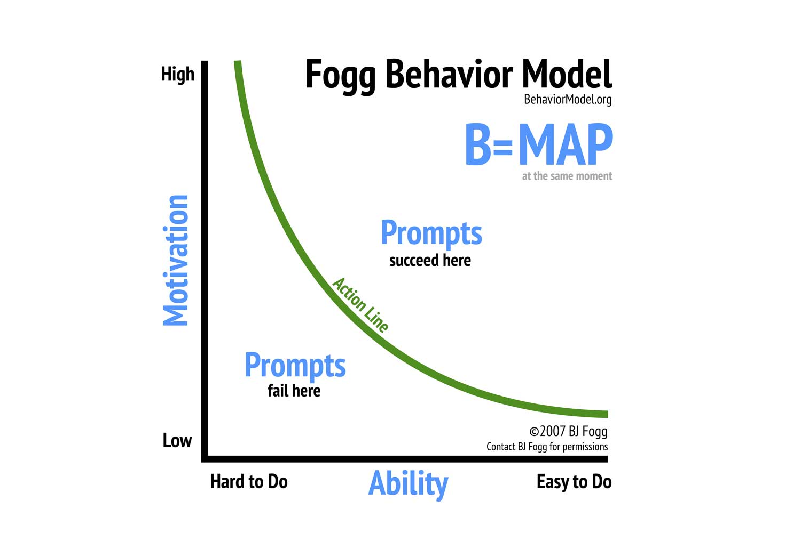
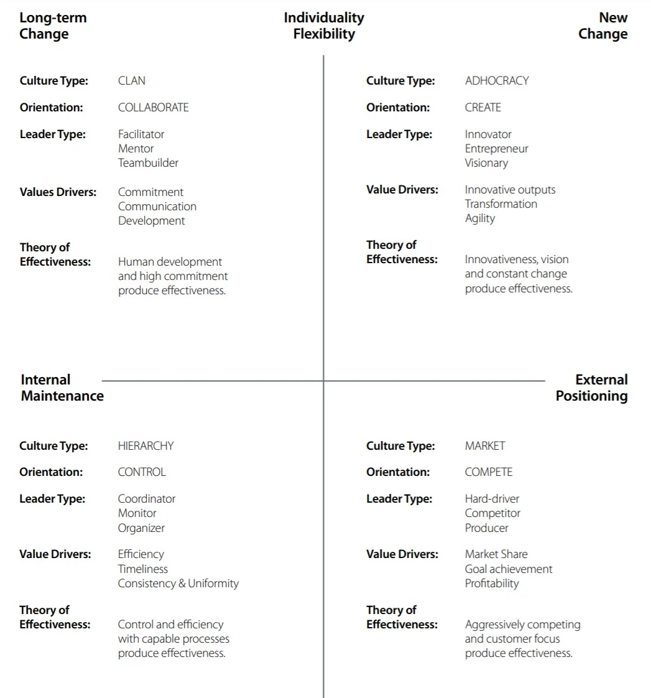

# Integrating Competing Values Framework and BJ Fogg Behavior Model for Organizational and Behavioral Excellence

## Introduction

This article explores the synergies between the Competing Values Framework (CVF) and the BJ Fogg Behavior Model, two influential theories in organizational development and behavior design. By examining their principles, elements, and practical applications, we aim to provide insights into how these models can be utilized together to enhance organizational culture and facilitate effective behavior change.

## BJ Fogg Behavior Model

Begin with a concise overview of the BJ Fogg Behavior Model, highlighting its significance in explaining the mechanisms behind human behavior change. Mention the model's broad application across different fields and its foundational elements: motivation, ability, and triggers.

*(Fonte: [Fogg Behavior Model](https://behaviormodel.org/))*

### Motivation

- **Definition**: Introduce motivation as a key driver of behavior, influenced by desires and needs.
- **Factors Influencing Motivation**:
  - **Pleasure vs. Pain**: Discuss how the pursuit of pleasure or the avoidance of pain motivates actions.
  - **Hope vs. Fear**: Explore how the anticipation of positive outcomes or the avoidance of negative ones shapes behavior.
  - **Social Acceptance vs. Rejection**: Consider the impact of social dynamics on motivational levels.
- **Practical Example**: Use a relatable scenario, such as email subscription incentives, to illustrate how motivation impacts behavior.

### Ability (Simplicity)

- **Definition**: Define ability as the ease with which a person can perform a desired behavior.
- **Elements of Simplicity**: Break down the six factors that contribute to simplicity:
  1. Time
  2. Money
  3. Physical Effort
  4. Mental Effort
  5. Social Deviance
  6. Routine
- **Simplicity as a Scarce Resource**: Discuss how simplicity varies based on the individual's context and resource availability.
- **Practical Example**: Highlight Amazon's "one-click purchase" as a classic example of reducing effort to increase behavior frequency.

### Triggers

- **Definition**: Explain triggers as cues or signals that prompt the execution of a behavior.
- **Effectiveness of Triggers**: Emphasize the timing and context dependence of effective triggers.
- **Types of Triggers**:
  - **Spark**: For those lacking motivation.
  - **Facilitator**: For those with motivation but lacking ability.
  - **Signal**: For those ready to act, serving as a reminder.
- **Practical Example**: Provide examples of each trigger type in action, linking back to everyday behaviors or well-known digital experiences.

### The Equation of Behavior: Motivation x Ability x Trigger

- **Interplay of Elements**: Discuss how motivation, ability, and triggers must align for a behavior to occur.
- **Balancing Factors**: Explore the compensatory relationship between motivation and ability.
- **Strategic Use of Triggers**: Highlight the importance of appropriate trigger application based on the existing levels of motivation and ability.

### Applying the BJ Fogg Behavior Model in Various Contexts

Offer insights into the model's application across different fields, such as product design, where understanding and influencing user behavior is crucial. Include case studies or examples where strategies based on the BJ Fogg Behavior Model have led to successful behavior change initiatives.

### Real-World Use Case: Fitbit's Application of the BJ Fogg Behavior Model

Fitbit, a leading health and fitness tracker, exemplifies the successful application of the BJ Fogg Behavior Model through its features designed to motivate users, simplify health tracking, and provide timely triggers to encourage physical activity and healthier habits.

- **Motivation (Enhancing User Desire)**: Fitbit boosts motivation through a combination of immediate feedback on progress (like steps taken and calories burned), competitive challenges with friends, and badges for achievements. These elements leverage the pleasure principle and the desire for social acceptance, increasing users' motivation to engage in physical activity.
- **Ability (Simplifying the Process)**: The simplicity of using Fitbit is a key factor in its ability to enable behavior change. Its user-friendly interface and the automatic tracking of activities lower the effort required from users to monitor their health metrics. This ease of use addresses the ability component by minimizing both physical effort and time needed to engage with the product.
- **Triggers (Prompting Action at the Right Time)**: Fitbit employs effective triggers to prompt user action, such as push notifications reminding users to move if they haven't reached their hourly step goal or to partake in a weekly challenge. These triggers are carefully timed to catch users when they are both motivated and able to take action, thereby maximizing the likelihood of engaging in the desired behavior.

## The Competing Values Framework (CVF)

The CVF, developed by Robert Quinn and John Rohrbaugh, offers a robust framework for assessing and understanding organizational culture. By categorizing organizational cultures into four quadrants based on two dimensions—flexibility vs. stability and internal focus vs. external focus—it helps identify the prevailing culture within an organization and guides strategic direction for development and change.

### The Four Quadrants of CVF

- **Collaboration (Clan)**: Emphasizes an internal focus and flexibility, fostering a family-like culture with a high emphasis on mentoring and nurturing.
- **Creation (Adhocracy)**: Prioritizes external focus and flexibility, encouraging innovation and adaptability to market changes.
- **Control (Hierarchy)**: Focuses on internal processes and stability, valuing order, efficiency, and a structured approach to organizational goals.
- **Competition (Market)**: Centers on external focus and stability, striving for competitiveness and goal achievement.

*(Fonte: [The competing values framework & Culture Contract [Quinn & NOBL]](https://orghacking.com/the-competing-values-framework-culture-contract-quinn-nobl-7d1471c2cbe9))*

## Summary: Leveraging the BJ Fogg Behavior Model for Effective Behavior Change

Our exploration of the BJ Fogg Behavior Model (FBM) has illuminated its profound impact on understanding and facilitating behavior change across diverse contexts, from health and wellness to marketing and personal development. By dissecting the model's core components—motivation, ability, and triggers—we've demonstrated how these elements interact to influence human behavior. The practical application of this model in the design and functionality of Fitbit has further underscored its effectiveness in promoting healthier lifestyles through technology.

- **Understanding Motivation**: We delved into how different motivators, such as the pursuit of pleasure, the avoidance of pain, and the need for social acceptance, drive human actions. Recognizing these motivators is crucial for creating strategies that engage and encourage individuals to change their behavior.

- **Facilitating Ability**: Highlighting the importance of simplicity, the discussion on ability showed that reducing effort and complexity is key to enabling desired behaviors. This principle is crucial for designing user experiences that minimize barriers to action.

- **Identifying Effective Triggers**: Our examination of triggers revealed the necessity of timely and contextually relevant cues that prompt individuals to act. The right triggers, delivered when users are both motivated and able, can significantly increase the likelihood of taking the desired action.

- **Real-World Application - Fitbit**: The Fitbit case study exemplified the FBM in action, showcasing how a health and fitness platform can successfully employ motivation, ability, and triggers to foster regular physical activity among its users. Fitbit's approach to personal motivation, its user-friendly design that enhances ability, and its use of timely triggers through notifications and challenges illustrate the model's applicability in creating engaging and effective products.

## Useful Links

- [Diagnosing and Changing Organizational Culture: Based on the Competing Values Framework / Kim S. Cameron, Robert E. Quinn](https://www.researchgate.net/profile/Tahani-Aldahdouh-2/post/Is-the-any-test-or-questionnaire-to-measure-the-organizational-climate-anyone-can-suggest/attachment/59d61f45c49f478072e97966/AS%3A271750183489537%401441801700739/download/Diagnosing+and+changing+organizational+culture+Based+on+the+competing+values+framework.pdf)
- [Competing Values Framework - ToolsHero](https://www.toolshero.com/leadership/competing-values-framework/)
- [O Modelo de Cultura Compete Values Framework - Persora](https://persora.com.br/2021/02/o-modelo-de-cultura-compete-values-framework/)
- [The Competing Values Framework: Culture Contract - OrgHacking](https://orghacking.com/the-competing-values-framework-culture-contract-quinn-nobl-7d1471c2cbe9)
- [Organizational Models Beyond Fixed Hierarchy - Corporate Rebels - OrgHacking](https://orghacking.com/organizational-models-beyond-fixed-hierarchy-corporate-rebels-1f06cc06521a)
- [Competing Values Framework - Denver Leadership](https://denverleadership.org/wp-content/uploads/2016/01/Competing-Values-Framework.pdf)
- [An Introduction to the Competing Values Framework - RCF Group](https://www.thercfgroup.com/files/resources/an_introduction_to_the_competing_values_framework_white_paper-pdf-28512.pdf)
- [Competing Values Framework Can Help Organizations Improve Global Strategic Performance - Regent University](https://www.regent.edu/journal/emerging-leadership-journeys/competing-values-framework-can-help-organizations-improve-global-strategic-performance/)
- [Competing Values Framework - Want to Work There](https://www.wanttoworkthere.com/competing-values-framework)
- [Culture Assessment Workbook - Boom Hoger Onderwijs](https://www.boomhogeronderwijs.nl/media/8/download_pdf_culture_assessment_workbook.pdf)
- [Behavior Model Paper: A Behavior Model for Persuasive Design (2009) por BJ Fogg](https://drive.google.com/file/d/19LYba4fuceGM3KhqxTXByV4msmb33t1o/view)