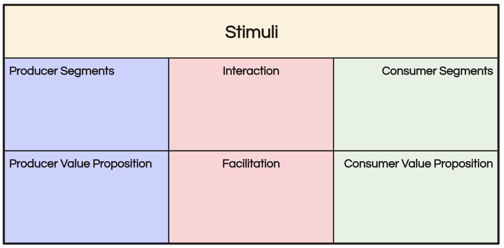

# Activity - Platform Engineering Canvas

> 1. **Segmentation and Value Propositions**: Identify consumer and producer segments, detailing their needs and outlining the benefits the platform provides to each group.
> 
> 2. **Interaction and Facilitation**: Describe the mechanisms enabling platform interactions and how it supports and optimizes these exchanges.
> 
> 3. **Engagement and Platform Model**: Discuss strategies for engaging participants and integrate all elements into a cohesive platform model.

## 🚨 Challenge

You are tasked with developing a Platform Engineering Canvas for a new DevOps platform. This platform aims to serve a wide range of development teams and individual developers by offering streamlined CI/CD pipelines, integrated DevOps tools, and a supportive environment for both consumers and producers. Your challenge is to flesh out each component of the Platform Engineering Canvas, ensuring a balanced and engaging ecosystem that encourages adoption, interaction, and sustained growth.

- **Stimuli**: External factors impacting platform dynamics, often beyond the platform's direct control.
  *Example: Economic conditions affecting user spending habits, technological advancements shaping user preferences, regulatory changes impacting platform operations.*

- **Facilitation**: Platform's efforts to enable and streamline interactions between users.
  *Example: Payment processing systems, dispute resolution mechanisms, user support services.*

- **Interaction**: Exchange of information or resources between Producer and Consumer Segments.
  *Example: Matching of service providers and users, communication channels, feedback mechanisms.*

- **Producer Segments**: Groups of users providing goods or services on the platform.
  *Example: Uber drivers offering transportation services, Airbnb hosts providing accommodations.*

- **Consumer Segments**: Groups of users consuming goods or services on the platform.
  *Example: Uber passengers seeking transportation, Airbnb guests looking for accommodations.*

- **Producer Value Proposition**: Value offered to Producer Segments by participating in the platform ecosystem.
  *Example: Uber drivers gaining income opportunities and flexible work schedules, Airbnb hosts accessing a global customer base.*

- **Consumer Value Proposition**: Value perceived by Consumer Segments in using the platform's goods or services.
  *Example: Convenient access to transportation options, diverse accommodation choices, user-friendly interfaces.*

### Phase 1 - Understanding Your Audience and Their Needs (Consumer Insights & Value Proposition)

- **Objective:** Combine the identification of technical challenges, preferences, and usage contexts of target users with the description of the technical benefits and solutions the platform offers.
- **Instructions:**
  1. **Identify Consumer Segments:** Define the technical needs and opportunities faced by consumer segments. Consider the variety of tasks they perform, the challenges they encounter in their workflow, and the solutions they seek.
     - Create detailed personas for these consumers, focusing on their technical skills, primary objectives, and the environments in which they operate.
  2. **Craft Consumer Value Propositions:** Based on the identified consumer segments, highlight how the platform addresses their specific needs, improving efficiency and delivering unique functionalities. Think about integration with existing tools, automation capabilities, and any innovative features that distinguish your platform.
     - Ensure that the platform's design and offerings are user-centric and accessible, enhancing the overall user experience with factors like usability, accessibility, and the learning curve for new users.

In this phase, your goal is to lay a solid foundation for your Platform Engineering Canvas by deeply understanding your audience and crafting compelling value propositions that resonate with their needs and expectations. This understanding is crucial for developing a platform that is not only technically robust but also highly valued by its users.

### Phase 2 - Empowering Producers and Crafting Their Value (Producer Engagement & Value Creation)

- **Objective:** Integrate the characterization of producers who will create and maintain the platform's services with the definition of the value propositions offered to these producers.
- **Instructions:**
  1. **Identify Producer Segments:** Characterize the developers, organizations, or entities responsible for creating and maintaining the platform's services or goods. Focus on identifying the key contributions these producer segments will bring to the platform, such as unique services, content, or technological innovations.
     - Discuss the integration process for these producers, highlighting any necessary APIs, development tools, or standards that ensure a seamless and efficient integration into the platform ecosystem.
  2. **Craft Producer Value Propositions:** Define the benefits that the platform offers to its producers. This includes explaining how the platform assists producers in reaching a broader audience, streamlining their development processes, and effectively leveraging platform resources to enhance their offerings.
     - Address the support and tools provided by the platform to facilitate a smooth onboarding experience for producers and ensure their ongoing development efforts are supported. Consider elements like documentation, developer portals, SDKs, and community forums that aid in this process.

This phase is crucial for building a platform that is attractive not only to its consumers but also to its producers, ensuring a vibrant ecosystem where both sides find value and support. By clearly defining the roles and benefits for producers, you set the stage for a collaborative environment that fosters innovation and growth.

## Phase 3 - Operational Excellence and Engagement Strategies (Interaction, Facilitation, and Stimuli)

- **Objective:** Combine detailing the technical infrastructure that enables interactions between consumers and producers with outlining how the platform secures and optimizes these exchanges.
- **Instructions:**
  1. **Engagement Mechanisms:** Highlight how the platform uses technologies such as machine learning or data analytics to create dynamic engagement mechanisms. These could include personalized content delivery, automated recommendations, or interactive dashboards that provide insights to users.
  2. **Incentivization Strategies:** Describe the incentives designed for both consumers and producers, focusing on how these incentives align with the platform's objectives. This includes any financial models, recognition systems, or opportunities for community engagement and growth.
  3. **Build Stimuli for Engagement:** Develop and detail strategies and tools aimed at attracting, engaging, and retaining platform participants. Consider the use of gamification, challenges, leaderboards, or reward systems that stimulate continuous interaction and contribution. Describe how these stimuli are integrated within the platform to enhance user experience and foster a sense of community and achievement among participants.

This final phase is crucial for ensuring the platform is not only technically robust and secure but also actively supports and promotes a thriving ecosystem of engaged participants. By focusing on interaction, facilitation, and engagement, you lay the groundwork for a platform that not only meets the immediate needs of its users but also encourages long-term growth and innovation.
