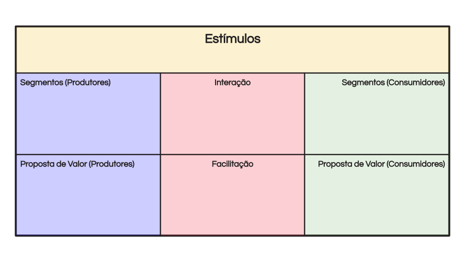
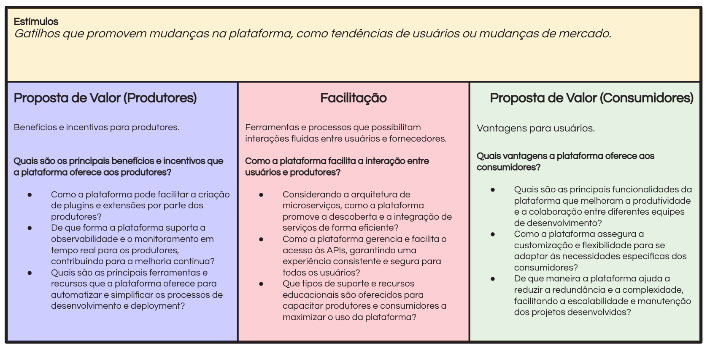
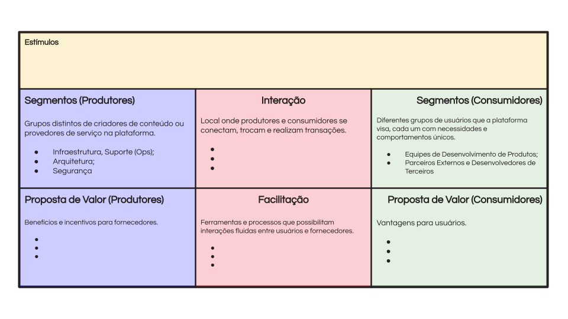

# Atividade - Plataforma de Engenharia Canvas

> 1. **Segmentação e Proposições de Valor**: Identifique segmentos de consumidores e produtores, detalhando suas necessidades e delineando os benefícios que a plataforma oferece a cada grupo.
>
> 2. **Interação e Facilitação**: Descreva os mecanismos que possibilitam interações na plataforma e como ela suporta e otimiza essas trocas.
>
> 3. **Engajamento e Modelo de Plataforma**: Discuta estratégias para engajar participantes e integrar todos os elementos em um modelo de plataforma coeso.

## 🚨 Desafio

Você tem a tarefa de desenvolver um Canvas de Engenharia de Plataforma para uma nova plataforma DevOps. Esta plataforma visa atender uma ampla gama de equipes de desenvolvimento e desenvolvedores individuais, oferecendo pipelines CI/CD simplificados, ferramentas DevOps integradas e um ambiente de suporte tanto para consumidores quanto para produtores. Seu desafio é elaborar cada componente do Canvas de Engenharia de Plataforma, garantindo um ecossistema equilibrado e engajador que incentive a adoção, interação e crescimento sustentado.

- **Estímulos**: Fatores externos que impactam a dinâmica da plataforma, muitas vezes além do controle direto da plataforma.
  *Exemplo: Condições econômicas afetando os hábitos de gastos dos usuários, avanços tecnológicos moldando as preferências dos usuários, mudanças regulatórias impactando as operações da plataforma.*

- **Facilitação**: Esforços da plataforma para habilitar e agilizar interações entre os usuários.
  *Exemplo: Sistemas de processamento de pagamento, mecanismos de resolução de disputas, serviços de suporte ao usuário.*

- **Interação**: Troca de informações ou recursos entre os Segmentos de Produtores e Consumidores.
  *Exemplo: Correspondência de prestadores de serviços e usuários, canais de comunicação, mecanismos de feedback.*

- **Segmentos de Produtores**: Grupos de usuários que fornecem bens ou serviços na plataforma.
  *Exemplo: Motoristas da Uber oferecendo serviços de transporte, anfitriões do Airbnb fornecendo acomodações.*

- **Segmentos de Consumidores**: Grupos de usuários que consomem bens ou serviços na plataforma.
  *Exemplo: Passageiros da Uber buscando transporte, hóspedes do Airbnb procurando acomodações.*

- **Proposição de Valor para o Produtor**: Valor oferecido aos Segmentos de Produtores pela participação no ecossistema da plataforma.
  *Exemplo: Motoristas da Uber ganhando oportunidades de renda e horários de trabalho flexíveis, anfitriões do Airbnb acessando uma base de clientes global.*

- **Proposição de Valor para o Consumidor**: Valor percebido pelos Segmentos de Consumidores ao usar os bens ou serviços da plataforma.
  *Exemplo: Acesso conveniente a opções de transporte, escolhas diversificadas de acomodações, interfaces amigáveis ao usuário.*

## Instruções para a Atividade com o Canvas de Engenharia de Plataforma

**Passo 1:** Cada grupo de participantes deve identificar e listar pelo menos dois **Estímulos** que possam impactar a dinâmica da plataforma. Considerem aspectos como:

**Passo 2:** Cada grupo deve responder às seguintes perguntas sobre sua seção específica do canvas:

- **Grupo (A) - Proposta de Valor (Produtores):**
  - *Quais são os principais benefícios e incentivos que a plataforma oferece aos produtores?*
    - Como a plataforma pode facilitar a criação de plugins e extensões por parte dos produtores?
    - De que forma a plataforma suporta a observabilidade e o monitoramento em tempo real para os produtores, contribuindo para a melhoria contínua?
    - Quais são as principais ferramentas e recursos que a plataforma oferece para automatizar e simplificar os processos de desenvolvimento e deployment?

- **Grupo (B) - Interação e Facilitação:**
  - *Como a plataforma facilita a interação entre usuários e produtores?*
    - Considerando a arquitetura de microserviços, como a plataforma promove a descoberta e a integração de serviços de forma eficiente?
    - Como a plataforma gerencia e facilita o acesso às APIs, garantindo uma experiência consistente e segura para todos os usuários?
    - Que tipos de suporte e recursos educacionais são oferecidos para capacitar produtores e consumidores a maximizar o uso da plataforma?

- **Grupo (C) - Proposta de Valor (Consumidores):**
  - *Quais vantagens a plataforma oferece aos consumidores?*
    - Quais são as principais funcionalidades da plataforma que melhoram a produtividade e a colaboração entre diferentes equipes de desenvolvimento?
    - Como a plataforma assegura a customização e flexibilidade para se adaptar às necessidades específicas dos consumidores?
    - De que maneira a plataforma ajuda a reduzir a redundância e a complexidade, facilitando a escalabilidade e manutenção dos projetos desenvolvidos?

Essas perguntas são projetadas para incentivar uma reflexão profunda sobre como uma Internal Development Platform pode servir tanto aos produtores quanto aos consumidores dentro de um ambiente corporativo dinâmico e altamente tecnológico.

### Seções Pré-preenchidas para Referência

**Estímulos:**

- Novas tecnologias emergentes e frameworks que podem ser incorporados para melhorar a plataforma;
- Comentários, críticas e sugestões dos usuários internos que direcionam melhorias e novos recursos;
- Alterações nas leis ou regulamentos que exigem adaptações na segurança, privacidade e compliance da plataforma;
- Direcionamentos estratégicos que requerem o alinhamento das ferramentas e processos da plataforma;
- Pressões competitivas e tendências do mercado que influenciam a inovação e a manutenção da plataforma.

**Produtores:**

Os produtores são os indivíduos ou equipes responsáveis por construir, manter e aprimorar a plataforma. Eles criam as funcionalidades e serviços essenciais que a plataforma oferece. Aqui estão alguns exemplos típicos de Produtores para uma Plataforma de Desenvolvimento Interna:

1. **Equipe da Plataforma:** Principalmente responsável pelo desenvolvimento e gestão operacional da plataforma. Garante que a plataforma seja escalável, confiável e atenda às necessidades técnicas dos usuários.
2. **Infraestrutura e Suporte (Ops):** Equipes que gerenciam as infraestruturas de hardware e software subjacentes, garantindo alta disponibilidade e desempenho otimizado da plataforma.
3. **Equipe de Arquitetura:** Responsável pelo design da arquitetura da plataforma, garantindo que ela suporte as necessidades atuais e futuras de forma eficiente.
4. **Equipe de Segurança:** Assegura que a plataforma adere aos protocolos de segurança e requisitos de conformidade, protegendo a plataforma e seus usuários contra vulnerabilidades.
5. **Empresas Terceiras:** Companhias ou indivíduos que fornecem serviços ou componentes externos que se integram à plataforma, potencializando suas capacidades.
6. **Comunidades Open Source:** Contribuidores de comunidades de código aberto que podem fornecer código essencial, ferramentas ou insights que são incorporados à plataforma.
7. **Chapters & Guilds:** Grupos internos focados em áreas específicas de expertise (como gerenciamento de banco de dados, experiência do usuário, etc.) e contribuem padronizando práticas e ferramentas em toda a plataforma.

**Consumidores:**

Os consumidores são os usuários da plataforma. Eles utilizam as ferramentas, recursos e serviços fornecidos pela plataforma para desenvolver, implantar e gerenciar seus próprios aplicativos ou serviços. Aqui estão alguns exemplos típicos de Consumidores:

1. **Equipes de Desenvolvimento de Produtos:** Principais consumidores que usam a plataforma para construir e manter seus produtos ou serviços. Dependem da plataforma por suas características robustas e capacidades de integração sem costura.
2. **Parceiros Externos e Desenvolvedores de Terceiros:** Incluem empresas externas ou desenvolvedores independentes que utilizam a plataforma para desenvolver suas próprias soluções ou para integrar seus serviços aos seus.
3. **Unidades de Negócios Internas:** Embora não estejam diretamente envolvidas no desenvolvimento de produtos, essas unidades podem depender da plataforma para implantar ferramentas internas, realizar análises ou gerenciar dados empresariais.
4. **Analistas de Dados e Cientistas de Dados:** Usam a plataforma para acessar, processar e analisar grandes volumes de dados para insights de negócios, previsões e modelagem de dados.

