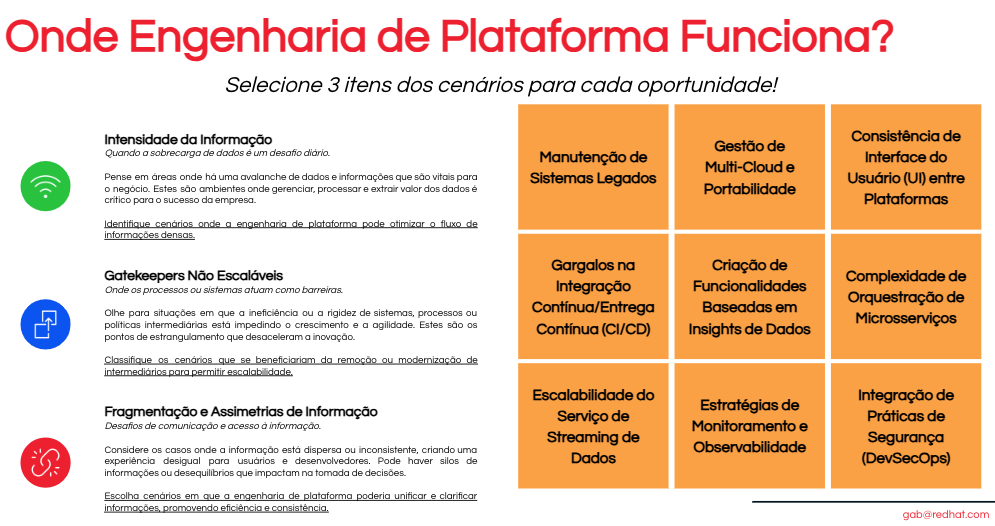

# Atividade: Identificando a Convergência de Desenvolvimento de Software com Platform Engineering

## Objetivo

Explorar como as tendências atuais e as práticas de desenvolvimento de software e DevOps estão alinhadas com os cenários de revolução de plataformas em diferentes indústrias. Os participantes devem relacionar contextos específicos de desenvolvimento de software com as áreas de oportunidade para transformação de plataformas.

## Situações de Desenvolvimento e DevOps para Matching

1. **Manutenção de Sistemas Legados**: Desenvolvedores enfrentam dificuldades para integrar novos recursos em sistemas legados devido à falta de documentação atualizada e a arquiteturas rígidas.

2. **Gargalos na Integração Contínua/Entrega Contínua (CI/CD)**: O pipeline de CI/CD está sofrendo com atrasos frequentes devido a testes falhos e integrações que quebram em ambientes de produção.

3. **Escalabilidade do Serviço de Streaming de Dados**: O aumento da demanda por serviços de streaming de dados em tempo real requer escalabilidade dinâmica para lidar com picos de tráfego.

4. **Gestão de Multi-Cloud e Portabilidade**: Desenvolvedores lutam para gerenciar e otimizar aplicações distribuídas em diferentes provedores de nuvem.

5. **Criação de Funcionalidades Baseadas em Insights de Dados**: Enfrentamos o desafio de projetar funcionalidades que maximizem o uso dos dados disponíveis. Com múltiplas fontes de dados operando em silos, o objetivo é sintetizar esses dados para informar e impulsionar o desenvolvimento de novas características, superando as barreiras da fragmentação de dados.

6. **Estratégias de Monitoramento e Observabilidade**: A missão é aprimorar a capacidade de observar e monitorar o comportamento de nossas aplicações. Isso envolve implementar soluções de monitoramento que não apenas detectem problemas, mas também forneçam insights acionáveis para performance em tempo real.

7. **Consistência de Interface do Usuário (UI) entre Plataformas**: Há uma inconsistência na UI entre as plataformas web e móveis, afetando a experiência do usuário.

8. **Gestão de Complexidade na Orquestração de Microsserviços**: Com o crescente uso de arquiteturas baseadas em microsserviços, surge a complexidade na orquestração eficaz desses serviços, especialmente ao escalar para produção. O desafio está em simplificar essa complexidade para manter a agilidade e a confiabilidade do sistema com o uso de ferramentas como Kubernetes.

9. **Integração de Práticas de Segurança (DevSecOps)**: A empresa busca integrar segurança no ciclo de desenvolvimento de software, mas encontra resistência cultural e técnica.

## Categorias para Classificação de Cenários

### Intensidade da Informação

*Quando a sobrecarga de dados é um desafio diário.*
Pense em áreas onde há uma avalanche de dados e informações que são vitais para o negócio. Estes são ambientes onde gerenciar, processar e extrair valor dos dados é crítico para o sucesso da empresa.
**Identifique cenários onde a engenharia de plataforma pode otimizar o fluxo de informações densas.**

### Gatekeepers Não Escaláveis

*Onde os processos ou sistemas atuam como barreiras.*
Olhe para situações em que a ineficiência ou a rigidez de sistemas, processos ou políticas intermediárias está impedindo o crescimento e a agilidade. Estes são os pontos de estrangulamento que desaceleram a inovação.
**Classifique os cenários que se beneficiariam da remoção ou modernização de intermediários para permitir escalabilidade.**

### Fragmentação e Assimetrias de Informação

*Desafios de comunicação e acesso à informação.*
Considere os casos onde a informação está dispersa ou inconsistente, criando uma experiência desigual para usuários e desenvolvedores. Pode haver silos de informações ou desequilíbrios que impactam na tomada de decisões.
**Escolha cenários em que a engenharia de plataforma poderia unificar e clarificar informações, promovendo eficiência e consistência.**

## Instruções

1. **Revisão e Discussão das Situações**: Comece com um brainstorming em grupo sobre as situações listadas acima relacionadas a desenvolvimento de software e DevOps.

2. **Compreensão dos Cenários**: Reveja os três cenários de revolução de plataformas. Discuta cada cenário e identifique por que são propensos à influência das plataformas.

3. **Matching de Situações com Cenários**: Relacione as situações de desenvolvimento de software e DevOps com os cenários de revolução de plataformas. Determine quais práticas se alinham melhor com cada cenário.

4. **Discussão em Grupos e Apresentação**: Em grupos, debata as melhores correspondências entre as situações e os cenários. Prepare-se para apresentar suas descobertas e o raciocínio por trás das escolhas feitas.

5. **Feedback Coletivo**: Após as apresentações, promova uma discussão aberta para considerar o feedback. Esta é uma oportunidade para avaliar os matches e expandir a compreensão das possíveis estratégias de transformação de plataforma.

## Resultado Esperado

Os participantes terão uma visão mais clara de como as práticas e abordagens em desenvolvimento de software e DevOps podem ser aplicadas para capitalizar as oportunidades de revolução de plataformas em várias indústrias.

## Materiais Necessários

- Quadro branco ou plataforma digital colaborativa
- Post-its ou marcadores digitais para brainstorming
- Descrições dos cenários de revolução de plataformas
