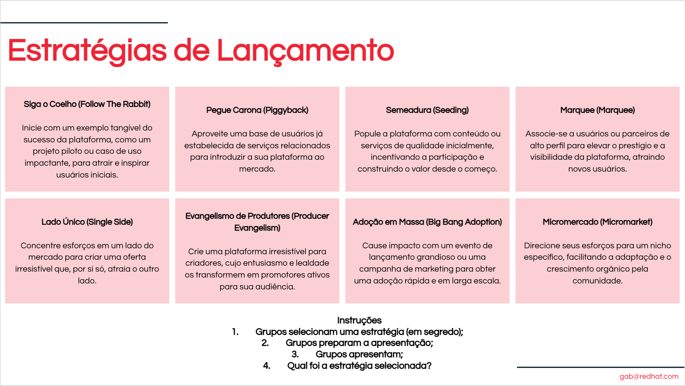

# Atividade - Plano de Lançamento da Equipe de Plataforma

> 1. **Seleção de Estratégia**: Escolha a estratégia mais adequada (ou combinação de estratégias) dentre as oito fornecidas para abordar efetivamente os desafios e oportunidades únicos do lançamento da sua plataforma.
>
> 2. **Definição da Proposta de Valor**: Defina claramente o valor único que sua plataforma oferece tanto para produtores quanto consumidores, aproveitando a estratégia de lançamento escolhida para destacar esse valor.
>
> 3. **Identificação do Público-Alvo**: Identifique e compreenda os usuários primários (produtores e consumidores) que sua plataforma pretende atender, adaptando sua estratégia de lançamento para atender às necessidades e preferências específicas deles.
>
> 4. **Planejamento de Implementação**: Desenvolva um plano detalhado para a implementação da sua estratégia escolhida, incluindo etapas, cronogramas e recursos necessários para garantir um lançamento de plataforma bem-sucedido.
>
> 5. **Estabelecimento de Métricas de Sucesso**: Defina métricas claras para medir o sucesso da sua estratégia de lançamento, focando no engajamento do usuário, crescimento da plataforma e nos níveis de satisfação de produtores e consumidores.
>
> 6. **Integração de Feedback e Iteração**: Planeje a coleta de feedback dos primeiros usuários e a iteração na sua estratégia e recursos da plataforma para melhorar e adaptar continuamente às necessidades do usuário.

## 🚨 Desafio

O desafio é projetar um plano de lançamento para uma Equipe de Plataforma, aproveitando estratégias comprovadas para atrair tanto produtores quanto consumidores para uma nova plataforma. O objetivo é criar um ecossistema vibrante onde ambos os lados encontrem valor, garantindo assim o crescimento e a sustentabilidade da plataforma.

## Estratégias para o Plano de Lançamento da Equipe de Plataforma

1. **Estratégia Siga o Coelho (Follow the Rabbit Strategy)**:
   - **Descrição**: Demonstre o potencial da sua plataforma através de um projeto piloto ou demonstração bem-sucedida.
   - **Dica**: Lance um projeto de impacto na plataforma que resolva um problema significativo para um grupo específico de usuários.

2. **Estratégia Pegue Carona (Piggyback Strategy)**:
   - **Descrição**: Aproveite uma base de usuários existente de uma plataforma ou serviço relacionado para impulsionar a sua plataforma.
   - **Dica**: Faça parceria com uma empresa ou plataforma existente que tenha uma base de usuários substancial interessada na sua oferta.

3. **Estratégia de Semeadura (Seeding Strategy)**:
   - **Descrição**: Popule ativamente sua plataforma com conteúdo ou serviços valiosos para atrair os primeiros usuários.
   - **Dica**: Ofereça incentivos para os primeiros criadores de conteúdo ou prestadores de serviços na sua plataforma.

4. **Estratégia Marquee (Marquee Strategy)**:
   - **Descrição**: Atraia usuários de alto valor ou parceiros principais cuja presença na plataforma incentive outros a se juntarem.
   - **Dica**: Onboard influenciadores ou empresas de alto perfil como os primeiros membros da sua plataforma.

5. **Estratégia Lado Único (Single Side Strategy)**:
   - **Descrição**: Foque inicialmente em oferecer um valor excepcional para um lado do mercado para atrair o outro lado organicamente.
   - **Dica**: Desenvolva um conjunto de ferramentas ou serviços que beneficiem significativamente produtores ou consumidores.

6. **Estratégia Evangelismo de Produtores (Producer Evangelism Strategy)**:
   - **Descrição**: Projete sua plataforma para ser extremamente atraente para os criadores de conteúdo, desenvolvedores ou prestadores de serviços.
   - **Dica**: Crie recursos ou benefícios específicos para produtores que os incentivem a trazer sua base de consumidores.

7. **Estratégia de Adoção em Massa (Big Bang Adoption Strategy)**:
   - **Descrição**: Crie um grande evento de lançamento ou uma blitz de marketing que gere burburinho e atenção generalizada.
   - **Dica**: Organize um grande evento ou campanha que destaque o valor único da plataforma e atraia muitos usuários rapidamente.

8. **Estratégia de Micromercado (Micromarket Strategy)**:
   - **Descrição**: Comece com um mercado muito pequeno e focado para crescimento rápido e iteração.
   - **Dica**: Mire em uma comunidade específica ou nicho onde sua plataforma possa rapidamente se tornar indispensável.

Utilize estas estratégias como um guia para criar um plano robusto de lançamento para sua equipe de plataforma, com foco em superar o problema inicial de atrair usuários e garantir um crescimento sustentável.

## Objetivos

- Selecione uma ou mais estratégias da lista acima que melhor se adequem às necessidades da sua organização e aos desafios específicos do lançamento de uma Equipe de Plataforma.
- Desenvolva um plano abrangente detalhando como você implementaria essa(s) estratégia(s) para lançar e fazer crescer seu ecossistema de plataforma com sucesso.

## Instruções para a Atividade de Lançamento

1. **Seleção de Estratégia em Segredo**: Cada grupo, de maneira confidencial, escolhe uma das estratégias de lançamento. Mantenha a escolha em segredo até a apresentação.

2. **Preparação da Apresentação**: Os grupos preparam a apresentação de suas estratégias, utilizando quadros, post-its e outros materiais para criar um cenário visual que descreva como pretendem lançar a plataforma baseando-se na estratégia selecionada.

3. **Apresentação dos Grupos**: Cada grupo apresenta sua estratégia, revelando como planejam atrair produtores e consumidores e destacar a proposta de valor única da plataforma.

4. **Revelação da Estratégia Selecionada**: Após as apresentações, cada grupo revela qual estratégia foi escolhida e discute o raciocínio por trás de sua seleção.

## Resultado Esperado

- Um plano de lançamento estratégico personalizado para alavancar as estratégias escolhidas para superar o problema "chicken-or-egg" e garantir o lançamento bem-sucedido de uma Equipe de Plataforma.
- Uma compreensão clara das etapas, recursos e métricas críticos para o crescimento inicial e contínuo da plataforma.

