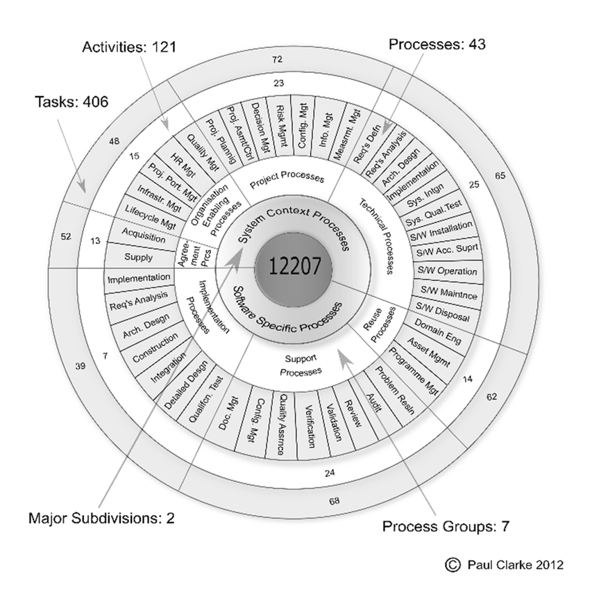

# Value Stream Mapping na Entrega de Aplicações: Guia da Atividade

> 1. **Desafio**: Nesta atividade, os participantes serão desafiados a organizar os processos da ISO/IEC 12207 em ordem. O foco é entender cada etapa do desenvolvimento de software e organizar essas etapas de forma lógica e eficiente.
> 
> 2. **ISO/IEC 12207**: Esta norma internacional fornece um conjunto abrangente de processos de ciclo de vida para software. Os participantes deverão se familiarizar com os processos e suas categorias para realizar a atividade.
> 
> 3. **Objetivo Principal**: Utilizar a ISO/IEC 12207 para visualizar e entender o fluxo de valor no desenvolvimento de software, identificar ineficiências e propor melhorias.

## 🚀 Desafio
Os participantes devem usar suas habilidades de análise para organizar os processos de ciclo de vida de software conforme descritos na ISO/IEC 12207, criando um mapa do fluxo de valor eficiente.

> **Sua missão é**:
> - Familiarizar-se com os processos listados na ISO/IEC 12207.
> - Organizar esses processos em uma sequência lógica que represente eficientemente o ciclo de vida do desenvolvimento de software.
> - Identificar gargalos e oportunidades de melhoria no processo proposto.

### Passos para a Atividade:

1. **Estudo da ISO/IEC 12207**: Entender a estrutura e os processos descritos na norma.
2. **Organização dos Processos**: Colocar os processos em uma ordem que faça sentido para o ciclo de vida do desenvolvimento de software.
3. **Mapeamento do Fluxo de Valor**: Utilizar os processos organizados para criar um mapa do fluxo de valor.
4. **Análise Crítica**: Identificar pontos de melhoria, gargalos ou ineficiências no fluxo de valor mapeado.
5. **Proposta de Melhorias**: Sugerir melhorias baseadas na análise crítica do fluxo de valor.

## Processos Técnicos, de Implementação de Software e de Suporte ao Software (Baseado na ISO/IEC 12207):

1. **Definição de Requisitos dos Stakeholders**: Define as necessidades dos stakeholders para criar requisitos que o software deve atender.
2. **Revisão de Software**: Avalia o software em diferentes estágios de seu desenvolvimento para garantir a conformidade com os requisitos.
3. **Integração de Software**: Combina unidades de software e componentes para formar um sistema completo.
4. **Gerenciamento de Configuração de Software**: Controla as versões e configurações do software durante seu desenvolvimento.
5. **Implementação de Software**: Realiza a construção do software, convertendo requisitos em uma solução operacional.
6. **Design Arquitetural de Software**: Desenvolve a arquitetura do software, definindo sua estrutura e comportamento.
7. **Análise de Requisitos de Software**: Analisa e refina os requisitos do software para garantir sua viabilidade e relevância.
8. **Teste de Qualificação de Software**: Testa o software para garantir que atende aos requisitos especificados.
9.  **Construção de Software**: Constrói o software, transformando seu design em código executável.
10. **Implantação de Software**: Envolve a distribuição, instalação e implementação do software no ambiente do usuário.

## Dinâmica do Grupo:
- Cada grupo receberá as descrições dos processos.
- Os grupos discutirão e organizarão os processos em uma sequência lógica.
- Cada grupo apresentará sua proposta de organização dos processos e discutirá suas descobertas.

## Preparação e Análise:
Os participantes devem se familiarizar com os conceitos da ISO/IEC 12207 e estar preparados para analisar e organizar os processos de desenvolvimento de software.

## Resultado Esperado:
Ao final da atividade, cada grupo terá organizado os processos da ISO/IEC 12207 em uma ordem que represente eficientemente o ciclo de vida do desenvolvimento de software, identificando oportunidades para otimização e melhoria.

## Anexos I - ISO/IEC 12207

*(Fonte: [A Complexity Theory viewpoint on the Software Development Process and Situational Context](https://www.researchgate.net/publication/303413102_A_complexity_theory_viewpoint_on_the_software_development_process_and_situational_context))*

## Atividade Extra: Mapeamento Baseado em História da Entrega de uma Feature

> **Opção para Facilitadores**: Como atividade complementar, os facilitadores podem optar por usar a história detalhada da entrega de uma funcionalidade como base para um exercício prático de Value Stream Mapping.

### História da Entrega de uma Feature
Era uma típica manhã de segunda-feira no escritório quando a equipe de desenvolvimento se reuniu para a reunião semanal. Durante a discussão, um dos desenvolvedores mencionou uma ideia que teve no fim de semana: uma nova funcionalidade que permitiria aos usuários criar playlists personalizadas de seus programas favoritos. A equipe ficou animada com a proposta, e rapidamente um esboço da ideia foi criado no quadro branco.

Após a reunião, a equipe de análise de negócios começou a trabalhar na viabilidade da ideia. Eles examinaram dados de uso, pesquisaram as tendências do mercado e prepararam um relatório detalhado. O relatório concluiu que a feature poderia aumentar significativamente o engajamento do usuário e oferecer uma experiência mais personalizada.

Com luz verde para prosseguir, a equipe de design de UI/UX assumiu o comando. Eles realizaram várias sessões de brainstorming, criando wireframes e protótipos para a nova funcionalidade. Cada detalhe, desde a localização dos botões até a facilidade de navegação, foi meticulosamente planejado.

Com os designs aprovados, a equipe de desenvolvimento entrou em ação. Divididos em pequenos grupos, eles começaram a codificar, usando metodologias ágeis para iterar rapidamente. Reuniões diárias de stand-up ajudaram a equipe a permanecer alinhada e a resolver problemas conforme surgiam.

Após algumas semanas de desenvolvimento, a primeira versão da funcionalidade estava pronta para ser testada. A equipe de QA (Quality Assurance) começou a testar exaustivamente, procurando bugs e avaliando a usabilidade. Cada problema encontrado era documentado e enviado de volta para a equipe de desenvolvimento para correção.

Antes do lançamento geral, a nova funcionalidade foi disponibilizada para um grupo selecionado de usuários para um teste beta. O feedback desses usuários foi inestimável, fornecendo insights sobre como a funcionalidade era usada no mundo real e o que poderia ser melhorado.

Com base no feedback do teste beta, a equipe fez os ajustes finais. Isso incluiu refinamentos na interface do usuário e melhorias na performance. Cada mudança foi novamente testada e validada.

Finalmente, chegou o grande dia do lançamento. A nova funcionalidade foi implementada para todos os usuários. A equipe de operações monitorou os servidores de perto, garantindo que tudo funcionasse sem problemas. Enquanto isso, a equipe de análise de dados começou a rastrear como a funcionalidade estava sendo usada, coletando dados para futuras melhorias.

Mesmo após o lançamento, a jornada não acabou. A equipe continuou a monitorar o uso, coletar feedback e trabalhar em melhorias. A funcionalidade de playlists personalizadas não era apenas um projeto concluído, mas uma evolução contínua, sempre buscando oferecer a melhor experiência possível ao usuário.

## Links Úteis
- [Value Stream Mapping - Open Practice Library](https://openpracticelibrary.com/practice/vsm-and-mbpm/)