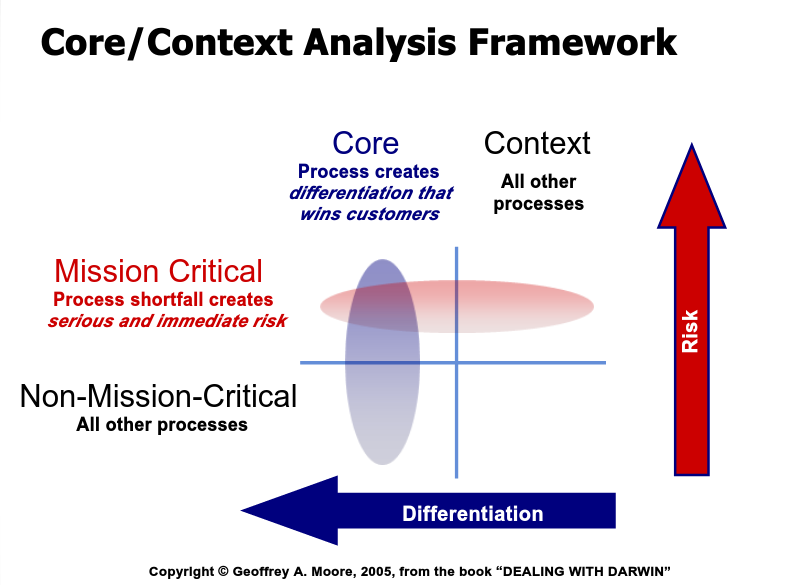

# Classificação de Processos com a Matriz Core/Context e SPACE Framework: Guia da Atividade

> 1. **Desafio**: Os participantes aplicarão a matriz "Core/Context" de Geoffrey Moore aos processos de desenvolvimento de software, avaliando sua relevância e criticidade. Além disso, analisarão como estes processos impactam as dimensões da produtividade dos desenvolvedores, utilizando o SPACE Framework.
> 
> 2. **Matriz Core/Context**: Ferramenta para distinguir entre atividades essenciais (Core) e necessárias mas não distintivas (Context), e entre as que são críticas ou não críticas para o sucesso do negócio.
> 
> 3. **SPACE Framework**: Uma abordagem multidimensional para entender a produtividade dos desenvolvedores, incluindo aspectos como satisfação, desempenho, atividade, comunicação, colaboração, eficiência e fluxo.

## 🚀 Desafio
Os participantes devem usar o conhecimento dos processos de entrega de software e aplicar a matriz "Core/Context" para classificá-los, considerando a importância estratégica de cada processo.

> **Sua missão é**:
> - Compreender cada processo listado na entrega de software e o SPACE Framework.
> - Classificar cada processo como "Core" ou "Context" e "Crítico" ou "Não Crítico", baseando-se na matriz de Geoffrey Moore.
> - Justificar a classificação com base em critérios de diferenciação e criticidade.

## O que é o SPACE Framework?
O SPACE Framework é um conjunto de dimensões usado para compreender a produtividade dos desenvolvedores. As dimensões incluem:
- **Satisfaction (Satisfação)**: Refere-se ao bem-estar e à satisfação dos desenvolvedores.
- **Performance (Desempenho)**: A eficiência e eficácia dos desenvolvedores em suas tarefas.
- **Activity (Atividade)**: O nível de engajamento e atividade dos desenvolvedores.
- **Communication and Collaboration**: A eficácia da comunicação e da colaboração dentro das equipes.
- **Efficiency and Flow**: A capacidade de trabalhar de forma eficiente e no estado de "flow".

*(Fonte: [The SPACE of Developer Productivity](https://queue.acm.org/detail.cfm?id=3454124))*

## O que é a Matriz Core/Context?
A matriz "Core/Context" de Geoffrey Moore é um modelo que ajuda as empresas a identificar suas atividades principais que são fundamentais para seu sucesso (Core) e aquelas que, embora necessárias, não oferecem vantagem competitiva direta (Context). Além disso, a matriz distingue entre atividades críticas e não críticas para o negócio.

*(Fonte: [Geoffrey Moore-Core and Context](https://www.youtube.com/watch?v=emQ2innvuPo))*

## Aplicação da Matriz e do SPACE Framework
Durante a atividade, os participantes irão simultaneamente classificar os processos de desenvolvimento de software usando a matriz Core/Context e avaliar o impacto de cada processo nas dimensões do SPACE Framework. Esta abordagem integrada permitirá aos participantes compreender como diferentes processos influenciam diretamente a satisfação, desempenho, atividade, comunicação, colaboração, eficiência e fluxo dos desenvolvedores. O objetivo é discernir quais processos são essenciais para a produtividade e inovação em desenvolvimento de software e como eles se alinham com as metas estratégicas da organização.

- **Core (Núcleo)**: Processos que diretamente impulsionam a produtividade dos desenvolvedores e inovam na entrega de software. Estes processos são cruciais para melhorar a satisfação (S do SPACE), o desempenho (P do SPACE) e a eficiência (E do SPACE). São os elementos que contribuem significativamente para a diferenciação da empresa no mercado.
- **Commodity (Contexto)**: Processos padrões de desenvolvimento de software que, embora necessários, não oferecem uma vantagem competitiva direta em termos de produtividade dos desenvolvedores. Esses processos devem ser otimizados para não impactar negativamente na atividade (A do SPACE) e na comunicação e colaboração (C do SPACE).
- **Crítico**: Processos importantes que, mesmo não sendo diferenciadores (Core), são essenciais para manter a operação contínua e a estabilidade. A falha nestas áreas pode afetar negativamente a satisfação dos desenvolvedores, a comunicação e a eficiência operacional.
- **Não Crítico**: Processos que, se não executados perfeitamente, têm um impacto limitado na produtividade geral dos desenvolvedores. Estes processos devem ser geridos de forma a maximizar a eficiência sem comprometer os recursos necessários para os processos Core e Críticos.

## Dinâmica do Grupo:
- Cada grupo analisará e classificará os processos de desenvolvimento de software com base na matriz Core/Context.
- Posteriormente, os grupos avaliarão o impacto de cada processo nas dimensões do SPACE Framework.
- Haverá uma discussão em grupo para justificar as decisões de classificação e avaliar o impacto dessas classificações na produtividade dos desenvolvedores.
- Cada grupo apresentará suas conclusões, destacando as implicações das suas classificações na eficiência e eficácia do desenvolvimento de software.

## Preparação e Análise:
Para se preparar para esta atividade, os participantes devem revisar os processos padrão de desenvolvimento de software e familiarizar-se com os conceitos da matriz Core/Context de Geoffrey Moore, bem como com as dimensões do SPACE Framework. A compreensão desses modelos ajudará os participantes a realizar análises mais precisas e fundamentadas durante a atividade.

## Resultado Esperado:
O resultado esperado desta atividade é uma compreensão mais profunda de como os processos de desenvolvimento de software se alinham com os objetivos estratégicos da organização e impactam a produtividade dos desenvolvedores. Os participantes aprenderão a identificar quais processos são vitais para impulsionar a inovação e eficiência, e quais processos, embora necessários, podem não contribuir diretamente para a vantagem competitiva da empresa. Isso permitirá uma alocação de recursos mais eficaz e uma melhor tomada de decisão estratégica.

